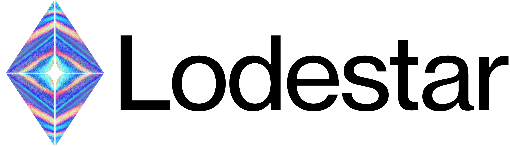

<p align="center"><a href="https://chainsafe.github.io/lodestar"></a></p>

# Lodestar Ethereum Consensus Implementation

[](https://github.com/ChainSafe/lodestar/releases/latest)
[](https://hub.docker.com/r/chainsafe/lodestar)
[](https://github.com/ethereum/consensus-specs/releases/tag/v1.4.0)


[](https://codecov.io/gh/ChainSafe/lodestar)
[](https://www.gitpoap.io/gh/ChainSafe/lodestar)


[Lodestar](https://lodestar.chainsafe.io) is a TypeScript implementation of the [Ethereum Consensus specification](https://github.com/ethereum/consensus-specs) developed by [ChainSafe Systems](https://chainsafe.io).

## Getting started

- :gear: Follow the instructions for [build from source](https://chainsafe.github.io/lodestar/run/getting-started/installation#build-from-source), [binaries](https://chainsafe.github.io/lodestar/run/getting-started/installation#binaries), or [Docker](https://chainsafe.github.io/lodestar/run/getting-started/installation#docker-installation) to install Lodestar. Or use our [Lodestar Quickstart scripts](https://github.com/ChainSafe/lodestar-quickstart).
- :books: Use [Lodestar libraries](https://chainsafe.github.io/lodestar/supporting-libraries/libraries/) in your next Ethereum Typescript project.
- :globe_with_meridians: Run a beacon node on [mainnet or a public testnet](https://chainsafe.github.io/lodestar/run/beacon-management/starting-a-node/).
- :computer: Utilize the whole stack by [starting a local testnet](https://chainsafe.github.io/lodestar/contribution/advanced-topics/setting-up-a-testnet/).
- :spiral_notepad: View the Lodestar [CLI commands and options](https://chainsafe.github.io/lodestar/reference/cli/).
- :nerd_face: View the [Package and dependency structure](https://chainsafe.github.io/lodestar/contribution/depgraph/).
- :memo: Prospective contributors can read the [contributing section](./CONTRIBUTING.md) to understand how we develop and test on Lodestar.
- :writing_hand: If you have questions [submit an issue](https://github.com/ChainSafe/lodestar/issues/new/choose) or join us on [Discord](https://discord.gg/yjyvFRP)!
  [](https://discord.gg/aMxzVcr)
- :rotating_light: Please note our [security policy](./SECURITY.md).
- :bird: Follow Lodestar on [Twitter](https://twitter.com/lodestar_eth) for announcements and updates! [](https://twitter.com/lodestar_eth)
- ✨ Ask [Lodestar Guru](https://gurubase.io/g/lodestar), an AI focused on Lodestar, to answer your questions based on data from Lodestar Docs. [](https://gurubase.io/g/lodestar) 

## Prerequisites

- :gear: [NodeJS](https://nodejs.org/) (LTS)
- :toolbox: [Yarn](https://classic.yarnpkg.com/lang/en/)

###### Developer Quickstart:

```bash
yarn install
yarn build
./lodestar --help
```

## Architecture Overview

- :package: This mono-repository contains a suite of Ethereum Consensus packages.
- :balance_scale: The mono-repository is released under [LGPLv3 license](./LICENSE). Note, that the packages contain their own licenses.

| Package                                                     | Version                                                                                                                     | License                                                                                                               | Docs                                                                                      | Description                                                                    |
| ----------------------------------------------------------- | --------------------------------------------------------------------------------------------------------------------------- | --------------------------------------------------------------------------------------------------------------------- | ----------------------------------------------------------------------------------------- | ------------------------------------------------------------------------------ |
| [`@chainsafe/lodestar`](./packages/cli)                     | [](https://www.npmjs.com/package/@chainsafe/lodestar)               | [](https://www.gnu.org/licenses/lgpl-3.0) | [](./packages/cli/)             | :computer: Command-line tool for Lodestar                                      |
| [`@lodestar/api`](./packages/api)                           | [](https://www.npmjs.com/package/@lodestar/api)                           | [](https://opensource.org/licenses/Apache-2.0)  | [](./packages/api)              | :clipboard: REST Client for the Ethereum Beacon API                            |
| [`@lodestar/beacon-node`](./packages/beacon-node)           | [](https://www.npmjs.com/package/@lodestar/beacon-node)           | [](https://www.gnu.org/licenses/lgpl-3.0) | [](./packages/beacon-node)      | :rotating_light: Beacon-chain client                                           |
| [`@lodestar/config`](./packages/config)                     | [](https://www.npmjs.com/package/@lodestar/config)                     | [](https://opensource.org/licenses/Apache-2.0)  | [](./packages/config)           | :spiral_notepad: Eth Consensus types and params bundled together               |
| [`@lodestar/db`](./packages/db)                             | [](https://www.npmjs.com/package/@lodestar/db)                             | [](https://opensource.org/licenses/Apache-2.0)  | [](./packages/db)               | :floppy_disk: Read/write persistent Eth Consensus data                         |
| [`@lodestar/flare`](./packages/flare)                       | [](https://www.npmjs.com/package/@lodestar/flare)                       | [](https://opensource.org/licenses/Apache-2.0)  | [](./packages/flare)            | :boom: Command tool for triggering non-standard actions                        |
| [`@lodestar/fork-choice`](./packages/fork-choice)           | [](https://www.npmjs.com/package/@lodestar/fork-choice)           | [](https://opensource.org/licenses/Apache-2.0)  | [](./packages/fork-choice)      | :fork_and_knife: Beacon-chain fork choice                                      |
| [`@lodestar/light-client`](./packages/light-client)         | [](https://www.npmjs.com/package/@lodestar/light-client)         | [](https://opensource.org/licenses/Apache-2.0)  | [](./packages/light-client)     | :bird: Ethereum Light client                                                   |
| [`@lodestar/logger`](./packages/logger)                     | [](https://www.npmjs.com/package/@lodestar/logger)                     | [](https://opensource.org/licenses/Apache-2.0)  | [](./packages/logger)           | :memo: NodeJS logger for Lodestar binaries                                     |
| [`@lodestar/params`](./packages/params)                     | [](https://www.npmjs.com/package/@lodestar/params)                     | [](https://opensource.org/licenses/Apache-2.0)  | [](./packages/params)           | :spider_web: Eth Consensus network parameters                                  |
| [`@lodestar/prover`](./packages/prover)                     | [](https://www.npmjs.com/package/@lodestar/prover)                     | [](https://opensource.org/licenses/Apache-2.0)  | [](./packages/prover)           | :white_check_mark: Ethereum Light client verifier for execution JSON-RPC calls |
| [`@lodestar/reqresp`](./packages/reqresp)                   | [](https://www.npmjs.com/package/@lodestar/reqresp)                   | [](https://opensource.org/licenses/Apache-2.0)  | [](./packages/reqresp)          | :telephone_receiver: Eth Consensus Req/Resp protocol                           |
| [`@lodestar/spec-test-util`](./packages/spec-test-util)     | [](https://www.npmjs.com/package/@lodestar/spec-test-util)     | [](https://opensource.org/licenses/Apache-2.0)  | [](./packages/spec-test-util)   | :test_tube: Test harness for Eth Consensus spec tests                          |
| [`@lodestar/state-transition`](./packages/state-transition) | [](https://www.npmjs.com/package/@lodestar/state-transition) | [](https://opensource.org/licenses/Apache-2.0)  | [](./packages/state-transition) | :mag_right: Eth Consensus beacon-state transition                              |
| [`@lodestar/types`](./packages/types)                       | [](https://www.npmjs.com/package/@lodestar/types)                       | [](https://opensource.org/licenses/Apache-2.0)  | [](./packages/types)            | :spiral_notepad: Eth Consensus TypeScript and SSZ types                        |
| [`@lodestar/utils`](./packages/utils)                       | [](https://www.npmjs.com/package/@lodestar/utils)                       | [](https://opensource.org/licenses/Apache-2.0)  | [](./packages/utils)            | :toolbox: Miscellaneous utility functions used across Lodestar                 |
| [`@lodestar/validator`](./packages/validator)               | [](https://www.npmjs.com/package/@lodestar/validator)               | [](https://www.gnu.org/licenses/lgpl-3.0) | [](./packages/validator)        | :bank: Validator client                                                        |

## Contributors

Read our [contributors document](/CONTRIBUTING.md), [submit an issue](https://github.com/ChainSafe/lodestar/issues/new/choose) or talk to us on our [Discord](https://discord.gg/yjyvFRP)!

## Meetings

Weekly contributor meetings are public and announced on Discord. Feel free to check out our meeting notes and documents on [HackMD](https://hackmd.io/@wemeetagain/rJTEOdqPS/%2FXBzvaQgMTyyMJuToWAEDjw). Post-September 2021, meeting notes can be found on the [Lodestar Wiki Page](https://github.com/ChainSafe/lodestar/wiki).

## Donations

We are a local group of Toronto open-source developers. As such, all of our open-source work is funded by grants. We all take the time out of our hectic lives to contribute to the Ethereum ecosystem.
If you want to donate, you can send us ETH at the following address: `lodestar.chainsafe.eth`
