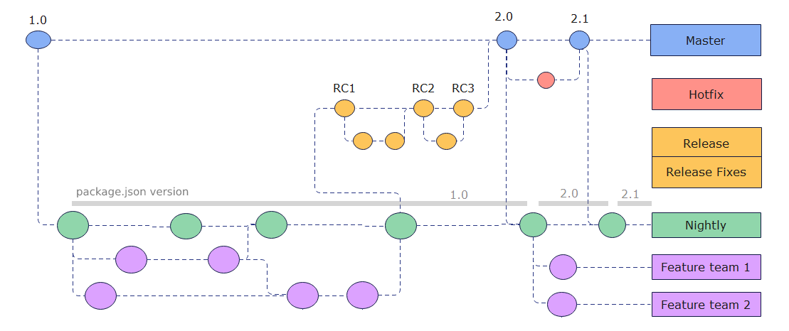

# Lodestar Release Guidelines

Lodestar is blockchain node securing the Ethereum Beacon chain network. It is run by external individuals and operator entities outside of the control of the Lodestar team. We, as most other core dev teams, choose a slow conservative approach to releasing to ensure that node runners always update to stable, safe and performant versions of our software.

Gitflow is a well-known strategy that suits our needs for security and stability.



## Stable release process

On day 0:

- The team selects a commit from `develop` as a "release candidate" for a new version release. As example target next version is `v0.34.0`, commit `9fceb02`.
- The selected commit is branched into a separate release branch (Example: `v0.34.0`)
- Bump mono-repo version to the future release commit.

```
lerna version minor --no-git-tag-version --force-publish --yes
```

- The resulting commit is tagged as `v0.34.0-beta.0`, released, and published for testing as a release-candidate
- The team creates a PR from branch `v0.34.0` to `master` with title `v0.34.0 release`.

```
yarn release-candidate -t v0.34.0-beta.0
```

After 3-5 days of testing, is performance equal or better than latest stable?

- **Yes**: If it a small issue fixable quickly (hotfix)?
  - **Yes**: push a commit to branch `v0.34.0` and re-start testing process with `v0.34.0-beta.1`. This fix can be ported immediately to develop, or wait for the release branch to be merged to master.
  - **No**: abort the release. Close the `v0.34.0 release` PR, and delete the associated branch, tag and release page.
- **No**: Merge `v0.34.0 release` PR to master, ensure proper version in source code, tag resulting commit as `v0.34.0` and release.

```
yarn release -t v0.34.0
```

When the pre-release candidate (Example: `v0.33.0-beta.0`) has met the testing requirements, we execute `release.yml`. This script will promote & tag the candidate to the `stable` release track and remove `beta.x`, publishing the version as `v0.33.0`. The CI will check and tag the new stable release, publish to the NPM Registry and to Docker Hub.

### Bug fixes to Pre-Releases

If there is a bug discovered during the pre-release testing period which significantly impacts performance, security or stability, and it is determined that it is no longer prudent to release the `beta.x` candidate as `stable`, then it will await a bug fix by the team. The fix will be committed, back-ported to `master` and we publish and promote the new commit to `beta.x+1`. The 3 day testing period minimums will reset.

### Pre-Release Testing Checklist

We test the pre-release candidate on multiple servers with a variance of connected validators on a stable testnet for a minimum of three (3) days.

The following observations must be taken into consideration before promoting the pre-release candidate to a `:stable` release:

- Are there any critical issues observed?
  - Examples: Memory leaks, abnormally high memory usage, abnormally high CPU performance, etc.
- Has profitibility been affected?
  - Has profitability decreased and whether or not the variance is acceptable.
- Has any performance metric degraded comparably to the previous `stable` release? If yes, is the variance acceptable?
  - Example: Block processing times, validator miss ratios, etc.

## Nightly release process

On every commit to develop a nightly / develop release is done automatically in CI. A nightly release:

- is not tagged
- does not have a release page
- is published to NPM
- is pushed to Dockerhub

The source code is mutated before release to set a version string of format `v0.37.0-dev.da9f72360`, where the appended hash is the merge commit hash to master that triggered this CI build. The semver version that prefixes it is mostly irrelevant in practical terms. The target consumers of such versions are automatic testing environments and other developers. They are expected to install via `dev` or `next` tags and refer to the whole version for debugging.

## Hotfix release process

If a stable version requires an immediate hotfix before the next minor or major release:

- Create a release branch `v0.37.1` from master at that version tag.
- Commit the hotfix to the `v0.37.1` branch and port to develop.
- Start a release process with testing, adjusting the length to the urgency and severity of the fix.

## Alternatives

Historical context and reasons against valid alternatives to help future discussions

**Master as single target**

Lodestar used master as the single target for feature branches.


- Main branch = master
- Features merged to master
- To trigger rc, branch from master to v0.37.x
- QA is done on v0.37.x branch
- Fixes on rc are done on v0.37.x, then retag
- Once released final v0.37.0 tag is on a branch that is never merged
- Hotfixes are done on new or existing v0.36.x branch, never merged

However this had some issues:

- Aborted releases left master in awkward version 2 minors ahead of stable. When triggering the release again, we had to rollback master
- Almost all release tags ended in branches not part of the master tree. This caused issues and confusing in tooling since it's not straightfoward to compute the diff between commits that are not direct parents of each other

**Continuous integration**

Another popular approach used by some entities but unsuitable for Lodestar. Given the complexity of a blockchain node, it's not possible to gurantee stable performance unless running the software for days in special conditions, not available in regular CI environments.
