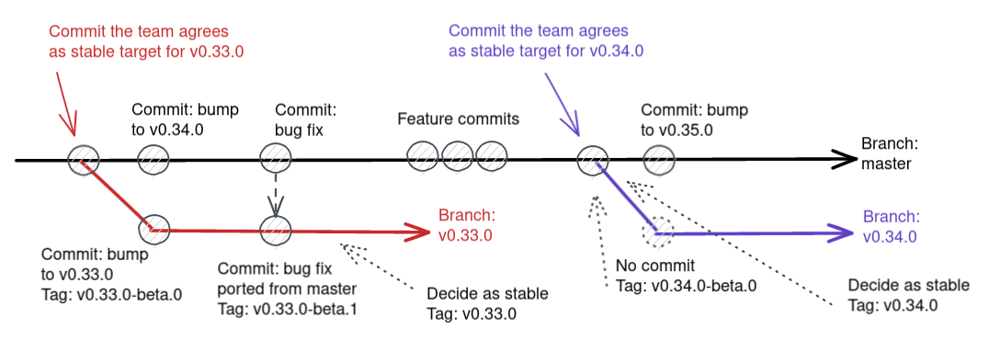

# Lodestar Release Guidelines

Lodestar is a blockchain node securing the Ethereum Beacon chain network. It is run by external individuals and operator entities outside of the control of the Lodestar team. We, as most other core dev teams, choose a slow conservative approach to releasing to ensure those node runners always update to stable, safe, and performant versions of our software.

Lodestar uses a modified version of gitflow to manage releases. [Gitflow](https://www.atlassian.com/git/tutorials/comparing-workflows/gitflow-workflow) is a well-known strategy that suits our needs for security and stability.

## Stable release

### When to a release

Lodestar does not have a fixed schedule for releases. Instead, they are published as the developers see fit.

The causes for a release are varied, however here are several common ones:

- To include a major bug-fix, optimization, or feature.
- To include a series of small changes which have shown to improve performance, usability, etc.
- If significant or risky PRs are waiting to merge and we wish to try and isolate those changes to a future release. I.e., to leave a "clean slate" for future PRs to apply to.

To start a new release, one of the Lodestar developers will communicate this via the Lodestar chat channel and seek consensus from the other developers.

### 1. Create release candidate

#### All-in-one script (for example version `v1.1.0`, commit `9fceb02`):

- The team selects a commit from `unstable` as a "release candidate" for a new version release.
- `yarn release:create-rc 1.1.0 9fceb02`
  - Must be run locally from a write-access account capable of triggering CI.
  - This script may alternatively be run on the the checked out `HEAD`:
    - `git checkout 9fceb02`
    - `yarn release:create-rc 1.1.0`
- Open draft PR from `rc/v1.1.0` to `stable` with title `v1.1.0 release`.

#### Manual steps (for example version `v1.1.0`, commit `9fceb02`):

- The team selects a commit from `unstable` as a "release candidate" for a new version release.
- Create a new release branch `rc/v1.1.0` at commit `9fceb02`.
  - `git checkout -b rc/v1.1.0 9fceb02`
- Set monorepo version to `v1.1.0`.
  - `lerna version v1.1.0 --no-git-tag-version --force-publish --yes`
- Commit changes
  - `git commit -am "v1.1.0"`
  - `git push origin rc/v1.1.0`
- Open draft PR from `rc/v1.1.0` to `stable` with title `v1.1.0 release`.

### 2. Tag release candidate

Tagging a release candidate will trigger CI to publish to NPM, dockerhub, and Github releases.

#### All-in-one script (for example version `v1.1.0`, commit `8ab7cef`):

- The team selects a commit from `rc/v1.1.0` as a commit to tag and publish.
- `yarn release:tag-rc 1.1.0 8ab7cef`
  - Must be run locally from a write-access account capable of triggering CI.
  - This script may alternatively be run on the the checked out `HEAD`:
    - `git checkout 8ab7cef`
    - `yarn release:tag-rc 1.1.0`

#### Manual steps (for example version `v1.1.0`, commit `8ab7cef`):

- Check out the commit:
  - `git checkout 8ab7cef`
- Tag resulting commit as `v1.1.0-rc.0` with an annotated tag, and push the tag.
  - `git tag -am "v1.1.0-rc.0" v1.1.0-rc.0`
  - `git push origin v1.1.0-rc.0`

### 3. Test release candidate

Once a release candidate is created, the Lodestar team begins a testing period.

If there is a bug discovered during the testing period which significantly impacts performance, security, or stability, and it is determined that it is no longer prudent to promote the `rc.x` candidate to `stable`, then it will await a bug fix by the team. The fix will be committed, maybe back-ported to `unstable` and we publish and promote the new commit to `rc.x+1`. The 3 day testing period will reset.

For example: After 3-5 days of testing, is performance equal to or better than latest stable?

- **Yes**: Continue to the next release step
- **No**: If it a small issue fixable quickly (hot-fix)?
  - **Yes**: push fixes to branch, go to step 2, incrementing the rc version
  - **No**: abort the release. Close the `v1.1.0 release` PR, delete the branch, and start the whole release process over.

### 4. Merge release candidate

- Ensure step 2 testing is successful and there is sufficient consensus to release `v1.1.0`.
- Approving the `v1.1.0 release` PR means a team member marks the release as safe, after personally reviewing and / or testing it.
- Merge `v1.1.0 release` PR to stable **with "merge commit"** strategy to preserve all history.
- Merge stable `stable` into `unstable` **with merge commit** strategy. Due to branch protections in `unstable` must open a PR. If there are conflicts, those must be resolved manually. Gitflow may cause changes that conflict between stable and unstable, for example due to a hotfix that is backported. If that happens, disable branch protections in unstable, merge locally fixing conflicts, run lint + tests, push, and re-enable branch protections.

### 5. Tag stable release

Tagging a stable release will trigger CI to publish to NPM, dockerhub, and Github releases.

#### All-in-one script (for example version `v1.1.0`):

- `git checkout stable`
- `yarn release:tag-stable 1.1.0`
  - Must be run locally from a write-access account capable of triggering CI.
#### Manual steps (for example version `v1.1.0`):

- Check out the new stable
  - `git checkout stable`
- Tag it as `v1.1.0` with an annotated tag, push commit and tag.
  - `git tag -am "v1.1.0" v1.1.0`
  - `git push origin v1.1.0`

### 6. Announce

- Double check that Github release is correct
- Publish to Social Media

## Hot-fix release

If a stable version requires an immediate hot-fix before the next release, a hot-fix release is started.

The same process for a stable release is used, with the two differences.
- The candidate commit must be chosen from the `stable` branch instead of the `unstable` branch.
- Depending on the severity of the bug being fixed, the testing window may be decreased.

## Dev release

On every commit to `unstable` a dev release is done automatically in CI. A dev release:

- is not tagged
- does not have a release page
- is published to NPM
- is pushed to Dockerhub

The source code is mutated before release to set a version string of format `v1.1.0-dev.da9f72360`, where the appended hash is the merge commit hash to `unstable` that triggered this CI build. The semver version that prefixes is expected to be the next minor version from the current code. The target consumers of such versions are automatic testing environments and other developers. They are expected to install via `next` tags and refer to the whole version for debugging.

## Details

### Publishing a release

The publishing of stable releases and release candidates is triggered by pushing a tag.

CI ensures the validity of the stable release and releases candidates by checking:

- the tag matches the version in the source
- for stable releases, the commit is the latest in the `stable` branch

This prevents accidentally publishing an incorrect version of Lodestar.

Dev releases are triggered on every new push to `unstable`.

Github workflows publish:

- to NPM registry
- to Dockerhub
- to Github releases

The behavior differs based on whether a stable release, a release candidate, or dev release is being performed.

- Stable release
  - published to npm with `latest` dist tag
  - published to docker with `latest` tag
  - a full Github release is published
- Release candidate
  - published to npm with `rc` dist tag
  - published to docker with `rc` tag
  - a prerelease Github release is published
- Dev release
  - published to npm with `next` dist tag
  - published to docker with `next` tag
  - no Github release is published

### How to test release candidates

We test the pre-release candidate on multiple servers with a variety of connected validators on a stable testnet for a minimum of three (3) days.

The following observations must be taken into consideration before promoting the release candidate to `stable`:

- Are there any critical issues observed?
  - Examples: Memory leaks, abnormally high memory usage, abnormally high CPU performance, etc.
- Has profitability been affected?
  - Has profitability decreased and whether or not the variance is acceptable.
- Has any performance metric degraded comparably to the previous `stable` release? If yes, is the variance acceptable?
  - Example: Block processing times, validator miss ratios, etc.

### Edit the Release

Releases are published automatically via CI.

Any additional release notes should be professional, comprehensive, and well-considered.

Have someone else review the release notes and then edit the release.

### Publish to Social Media

The release should be announced on the following social channels:

- Email: with Mailchimp.
- Discord: Use the #lodestar-announcements channel. Tag @everyone and ensure it is published to all downstream channels.
- Twitter: Short and sweet in a single tweet with twitter.com/lodestar_eth
- Reddit: TODO: get Lodestar account.

# Release Manager Checklist
This section is to guide the Release Manager tasked with the next version release to ensure all items have been completed.
- Start thread on communication channels for new release
- Confirm consensus on `unstable` release candidate commit
- Complete Step 1: Create release candidate
- Complete Step 2: Tag release candidate
- Deploy `rc.x` candidate to `beta` group of servers
- If there are `rc.x` hot fixes, push to branch and increment the `rc.x` version.
- Team members conduct Release Candidate Metrics Review
- A Lodestar team member must mark the release candidate as safe, after personally reviewing and / or testing it
- Backup `stable` and `unstable` branches locally for restoration incase of accidental use of the incorrect merge method
- Temporarily enable "Allow merge commits" under the Lodestar repository settings
- Release Manager can now complete Step 4: Merge release candidate.
- Disable "Allow merge commits" under the Lodestar repository settings
- Complete Step 5: Tag stable release
- Double check that Github release is correct and inform the Project Manager of completion
- Project Manager to follow up with Devops updating both `bn` and `vc` stable servers

## Alternatives considered

  
Click to expand!

Historical context and reasons against valid alternatives to help future discussions

**Version branches**

Lodestar used `master` as the single target for feature branches.

- Main branch = `master`
- Features merged to `master`
- To trigger rc, branch from `master` to `v1.1.x`
- `master` had package.json preemptively updated to the "next" version
- QA is done on `v1.1.x` branch
- Fixes on rc are done on `v1.1.x`, then re-tag
- Once released final `v1.1.0` tag is on a branch that is never merged
- Hot-fixes are either cherry-picked from `master` or done on the `v1.1.x` branch, never merged

However, this had some issues:

- Aborted releases left master in awkward version 2 minors ahead of `master`. When triggering the release again, we had to rollback `master`
- Almost all release tags ended in branches not part of the master tree. This caused issues since it's not straightforward to compute the diff between commits that are not direct parents of each other

**Continuous integration**

Always releasing `master` is another popular approach used by some entities but unsuitable for Lodestar. Given the complexity of a blockchain node, it's not possible to guarantee stable performance unless running the software for days under special conditions, not available in regular CI environments.

