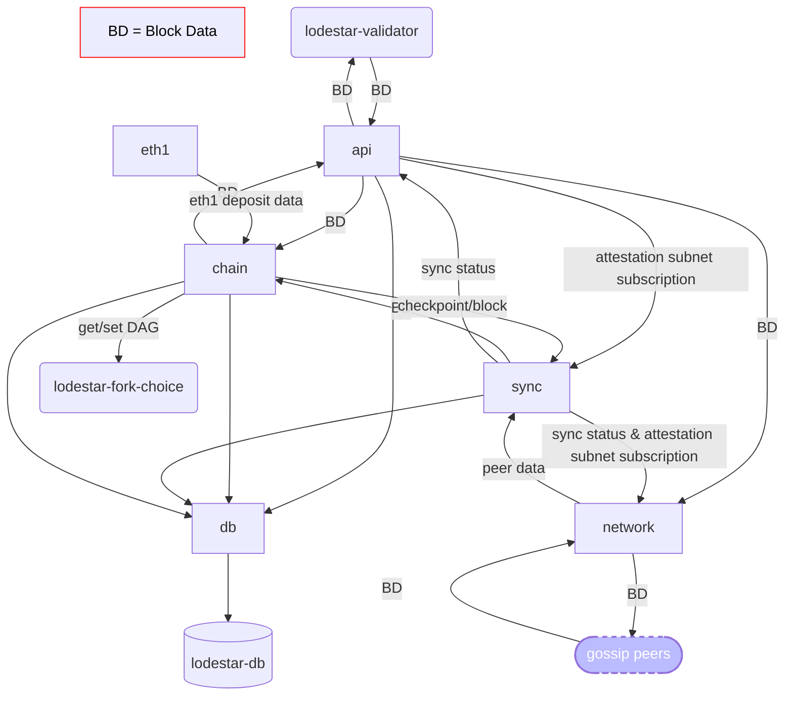

# Beacon Node Module Architecture

## lodestar beacon node modules

when `lodestar beacon --testnet TESTNET_NAME` is ran, [@chainsafe/lodestar-cli](https://github.com/ChainSafe/lodestar/tree/master/packages/lodestar-cli) does the following:
    - gathers data required to run the beacon node based on local configurations and CLI options
    - bootstraps the `BeaconNode` (in the `node` module) in [@chainsafe/lodestar](https://github.com/ChainSafe/lodestar/tree/master/packages/lodestar)

The `node` then bootstraps the `BeaconNode` modules:

Within [@chainsafe/lodestar](https://github.com/ChainSafe/lodestar), there are several modules that are started by the `node` process that bootstraps the beacon node:

### api
  - various REST API calls that can be made for:
    - beacon
        - get data about the beacon state and publish new data
    - events
        - sets up an event stream to listen for new beacon node events
    - node
        - get data about the node process that is running Lodestar
    - validator
        - perform (and get relevant data for) validator duties
### chain
  - processing block and attestation data to/from the beacon chain
### db
  - handles all persistent data stored to the local leveldb while running the beacon chain.  uses [@chainsafe/lodestar-db](https://github.com/ChainSafe/lodestar/tree/master/packages/lodestar-db) under the hood.
### eth1
  - handles all interactions with the eth1 blockchain (e.g. deposit data)
### metrics
  - exposes Lodestar metrics data that can be read using clients such as [Prometheus & Grafana](https://chainsafe.github.io/lodestar/usage/prometheus-grafana/)
### network
  - eth2 network implementation as defined by the [Eth2 Networking Spec](https://github.com/ethereum/eth2.0-specs/blob/dev/specs/phase0/p2p-interface.md)
### node
  - contains the nodeJS process that bootstraps and runs Lodestar
  - contains the entrypoint that [@chainsafe/lodestar-cli](https://github.com/ChainSafe/lodestar/tree/master/packages/lodestar-cli/) calls to start the beacon node
### sync
  - "syncing" is the process by which the beacon node stays updated with new data published on eth2.  there are two such processes in Lodestar:
      - initial sync
        - sync new data until we reach the head of the chain
      - regular sync
        - once we have finished initial sync (i.e. reached the head of the chain), regular sync keeps us updated in realtime as the chain head moves forward
### tasks
### util
  - various utility functions used by all of the above

### Beacon Node Data Flow

### Entry Paths for Data
* via `api`
    * a validator can be proposing a new block
* via `network`
    * req/resp - we can be explicitly requesting a block
    * gossip - we receive a block propagating across the network
  