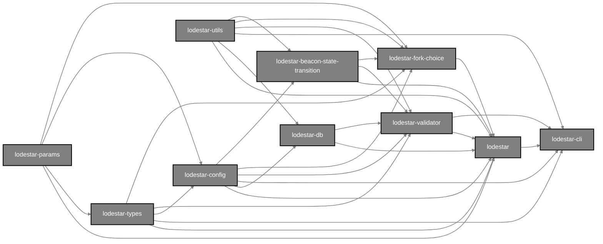

## Lodestar monorepo dependency graph

## @chainsafe/lodestar-* dep graph

```mermaid
graph LR
    lodestar["lodestar"]:::nodemodule
    cli["lodestar-cli"]:::nodemodule
    config["lodestar-config"]:::nodemodule
    db["lodestar-db"]:::nodemodule
    fork-choice["lodestar-fork-choice"]:::nodemodule
    params["lodestar-params"]:::nodemodule
    types["lodestar-types"]:::nodemodule
    utils["lodestar-utils"]:::nodemodule
    validator["lodestar-validator"]:::nodemodule
    state-trans["lodestar-beacon-state-transition"]:::nodemodule
    
    state-trans-->lodestar
    config-->lodestar
    db-->lodestar
    params-->lodestar
    types-->lodestar
    utils-->lodestar
    validator-->lodestar
    fork-choice-->lodestar
    
    config-->db
    utils-->db
    
    lodestar-->cli
    config-->cli
    types-->cli
    utils-->cli
    validator-->cli
    
    params-->types
    
    params-->config
    types-->config
    
    state-trans-->validator
    config-->validator
    types-->validator
    utils-->validator
    db-->validator
    
    state-trans-->fork-choice
    config-->fork-choice
    params-->fork-choice
    types-->fork-choice
    utils-->fork-choice
    
    config-->state-trans
    utils-->state-trans
    
    click cli "https://github.com/ChainSafe/lodestar/tree/master/packages/lodestar-cli"
    click lodestar "https://github.com/ChainSafe/lodestar/tree/master/packages/lodestar"
    click validator "https://github.com/ChainSafe/lodestar/tree/master/packages/lodestar-validator"
    click db "https://github.com/ChainSafe/lodestar/tree/master/packages/lodestar-db"
    click params "https://github.com/ChainSafe/lodestar/tree/master/packages/lodestar-params"
    click state-trans "https://github.com/ChainSafe/lodestar/tree/master/packages/lodestar-beacon-state-transition"
    click fork-choice "https://github.com/ChainSafe/lodestar/tree/master/packages/lodestar-fork-choice"
    click types "https://github.com/ChainSafe/lodestar/tree/master/packages/lodestar-types"
    click utils "https://github.com/ChainSafe/lodestar/tree/master/packages/lodestar-utils"
    click config "https://github.com/ChainSafe/lodestar/tree/master/packages/lodestar-config"

    classDef nodemodule fill:grey,stroke-width:2px,stroke:black,color:white;
    linkStyle default stroke:grey, fill:none,stroke-width:1.5px;
```
