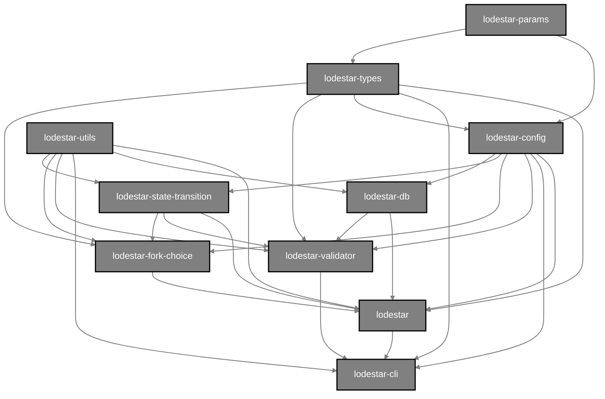

## Lodestar monorepo dependency graph

This is a diagram of the various `lodestar-*` packages in the Lodestar monorepo and how they fit together:

!!! info
note: this dependency graph only applies to dependencies as they are used in the `src/` folders of each package, not in `test/`

For a list of all the packages in the monorepo and a description for each, click [here](https://github.com/ChainSafe/lodestar#packages).

Let's talk about how each package fits together in finer detail, from top to bottom, following the chart.

## `@lodestar/params`

[@lodestar/params](https://github.com/ChainSafe/lodestar/tree/unstable/packages/params) contains the parameters for configuring an Ethereum Consensus network. For example, the [mainnet params](https://github.com/ethereum/consensus-specs/blob/v1.1.10/specs/phase0/beacon-chain.md#configuration)

## `@lodestar/types`

[@lodestar/types](https://github.com/ChainSafe/lodestar/tree/unstable/packages/types) contains Ethereum Consensus ssz types and data structures.

## `@lodestar/config`

[@lodestar/config](https://github.com/ChainSafe/lodestar/tree/unstable/packages/config) combines `@lodestar/params` and `@lodestar/types` together to be used as a single config object across the other Lodestar packages.

## `@lodestar/utils`

[@lodestar/utils](https://github.com/ChainSafe/lodestar/tree/unstable/packages/utils) contains various utilities that are common among the various Lodestar monorepo packages.

## `@lodestar/state-transition`

[@lodestar/state-transition](https://github.com/ChainSafe/lodestar/tree/unstable/packages/state-transition) contains the Lodestar implementation of the [beacon state transition function](https://github.com/ethereum/consensus-specs/blob/v1.1.10/specs/phase0/beacon-chain.md#beacon-chain-state-transition-function), which is used by `@lodestar/beacon-node` to perform the actual beacon state transition. This package also contains various functions used to calculate info about the beacon chain (such as `computeEpochAtSlot`) which are used by `@lodestar/fork-choice` and `@lodestar/validator`

## `@lodestar/db`

[@lodestar/db](https://github.com/ChainSafe/lodestar/tree/unstable/packages/db) is where all persistent data about the beacon node is stored. Any package that needs to read or write persistent beacon node data depends on `lodestar-db`.

## `@lodestar/fork-choice`

[@lodestar/fork-choice](https://github.com/ChainSafe/lodestar/tree/unstable/packages/fork-choice) holds the methods for reading/writing the fork choice DAG. The `@lodestar/beacon-node` package is the sole consumer of this package because the beacon node itself is what controls when the fork choice DAG is updated.
For a good explanation on how the fork choice itself works, see the [annotated fork choice spec](https://github.com/ethereum/annotated-spec/blob/v1.1.10/phase0/fork-choice.md). This is an annotated version of the [Ethereum Consensus fork choice spec](https://github.com/ethereum/consensus-specs/blob/v1.1.10/specs/phase0/fork-choice.md) which `lodestar-fork-choice` is based on.

## `@lodestar/validator`

[@lodestar/validator](https://github.com/ChainSafe/lodestar/tree/unstable/packages/validator) contains the validator client. The sole consumer of this package is `@chainsafe/lodestar`, which provides CLI access to run and configure the validator client. However, the validator client communicates to a REST API that is contained in `@lodestar/beacon-node` (specifically in the `api` module) to perform the validator duties.

## `@lodestar/beacon-node`

[@lodestar/beacon-node](https://github.com/ChainSafe/lodestar/tree/unstable/packages/beacon-node) contains the actual beacon node process itself, which is the aggregate of all the above packages and the "brain" of the Lodestar beacon chain implementation. All of the node modules live in this package as well.

## `@chainsafe/lodestar`

[@chainsafe/lodestar](https://github.com/ChainSafe/lodestar/tree/unstable/packages/cli) combines everything together for CLI usage and configuration of the beacon node and validator.
