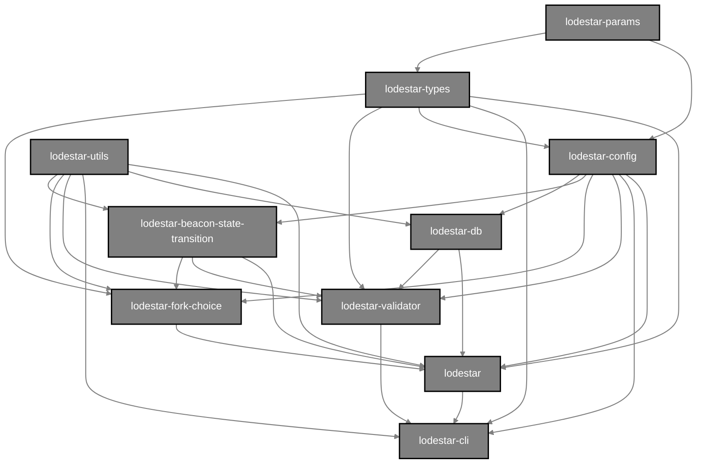

## Lodestar monorepo dependency graph

This is a diagram of the various `lodestar-*` packages in the Lodestar monorepo and how they fit together:

!!! info
note: this dependency graph only applies to dependencies as they are used in the `src/` folders of each package, not in `test/`

For a list of all the packages in the monorepo and a description for each, click [here](https://github.com/ChainSafe/lodestar#packages).

Let's talk about how each package fits together in finer detail, from top to bottom, following the chart.

## @chainsafe/lodestar-params

[@chainsafe/lodestar-params](https://github.com/ChainSafe/lodestar/tree/master/packages/params) contains the parameters for configuring an eth2 network. For example, the [mainnet params](https://github.com/ethereum/eth2.0-specs/blob/dev/configs/mainnet/phase0.yaml)

## @chainsafe/lodestar-types

[@chainsafe/lodestar-types](https://github.com/ChainSafe/lodestar/tree/master/packages/types) contains eth2 ssz types and datastructrues.

## @chainsafe/lodestar-config

[@chainsafe/lodestar-config](https://github.com/ChainSafe/lodestar/tree/master/packages/config) combines [`lodestar-params`](#chainsafelodestar-params) and [`lodestar-types`](#chainsafelodestar-types) together to be used as a single config object across the other Lodestar packages.

## @chainsafe/lodestar-utils

[@chainsafe/lodestar-utils](https://github.com/ChainSafe/lodestar/tree/master/packages/utils) contains various utilities that are common among the various Lodestar monorepo packages.

## @chainsafe/lodestar-beacon-state-transition

[@chainsafe/lodestar-beacon-state-transition](https://github.com/ChainSafe/lodestar/tree/master/packages/beacon-state-transition) contains the Lodestar implementation of the [beacon state transition function](https://github.com/ethereum/eth2.0-specs/blob/v0.10.0/specs/phase0/beacon-chain.md#beacon-chain-state-transition-function), which is used by [`@chainsafe/lodestar`](#chainsafelodestar) to perform the actual beacon state transition. This package also contains various functions used to calculate info about the beacon chain (such as `computeEpochAtSlot`) which are used by [@chainsafe/lodestar-fork-choice](#chainsafelodestar-fork-choice) and [@chainsafe/lodestar-validator](#chainsafelodestar-validator)

## @chainsafe/lodestar-db

[@chainsafe/lodestar-db](https://github.com/ChainSafe/lodestar/tree/master/packages/db) is where all persistent data about the beacon node is stored. Any package that needs to read or write persistent beacon node data depends on `lodestar-db`.

## @chainsafe/lodestar-fork-choice

[@chainsafe/lodestar-fork-choice](https://github.com/ChainSafe/lodestar/tree/master/packages/fork-choice) holds the methods for reading/writing the fork choice DAG. The [`@chainsafe/lodestar`](#chainsafelodestar) package is the sole consumer of this package because the beacon node itself is what controls when the fork choice DAG is updated.
For a good explainer on how the fork choice itself works, see the [annotated fork choice spec](https://github.com/ethereum/annotated-spec/blob/master/phase0/fork-choice.md). This is an annotated version of the [Eth2 fork choice spec](https://github.com/ethereum/eth2.0-specs/blob/v0.12.1/specs/phase0/fork-choice.md) which `lodestar-fork-choice` is based on.

## @chainsafe/lodestar-validator

[@chainsafe/lodestar-validator](https://github.com/ChainSafe/lodestar/tree/master/packages/validator) contains the validator client. The sole consumer of this package is [@chainsafe/lodestar-cli](#chainsafelodestar-cli), which provides CLI access to run and configure the validator client. However, the validator client communicates to a REST API that is contained in [@chainsafe/lodestar](#chainsafelodestar) (specifically in the [`api` module](../architecture/#api)) to perform the validator duties.

## @chainsafe/lodestar

[@chainsafe/lodestar](https://github.com/ChainSafe/lodestar/tree/master/packages/lodestar) contains the actual beacon node process itself, which is the aggregate of all the above packages and the "brain" of the Lodestar beacon chain implementation. All of the [node modules](../architecture) live in this package as well.

## @chainsafe/lodestar-cli

[@chainsafe/lodestar-cli](https://github.com/ChainSafe/lodestar/tree/master/packages/cli) combines everything together for CLI usage and configuration of the beacon node and validator.
