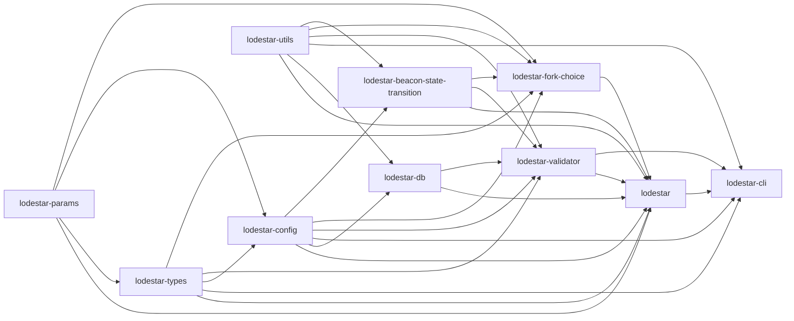

## Lodestar monorepo dependency graph

```mermaid
graph LR
    lodestar["lodestar"]
    cli["lodestar-cli"]
    config["lodestar-config"]
    db["lodestar-db"]
    fork-choice["lodestar-fork-choice"]
    params["lodestar-params"]
    types["lodestar-types"]
    utils["lodestar-utils"]
    validator["lodestar-validator"]
    state-trans["lodestar-beacon-state-transition"]
    
    state-trans-->lodestar
    config-->lodestar
    db-->lodestar
    params-->lodestar
    types-->lodestar
    utils-->lodestar
    validator-->lodestar
    fork-choice-->lodestar
    
    config-->db
    utils-->db
    
    lodestar-->cli
    config-->cli
    types-->cli
    utils-->cli
    validator-->cli
    
    params-->types
    
    params-->config
    types-->config
    
    state-trans-->validator
    config-->validator
    types-->validator
    utils-->validator
    db-->validator
    
    state-trans-->fork-choice
    config-->fork-choice
    params-->fork-choice
    types-->fork-choice
    utils-->fork-choice
    
    config-->state-trans
    utils-->state-trans
```