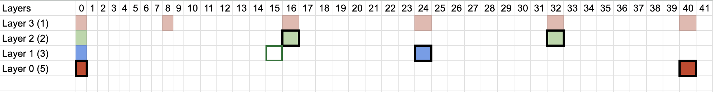

## Understanding Historical Sate Regeneration

To run a blockchain client and establish consensus we need the latest headers and forkchoice data. This operation does not involve historical data, specifically for periods that have already been finalized. Storing the full state information for the finalized slots increases the storage requirement significantly and is not suitable for running the node long-term.

### Solution

To overcome the storage problem for the archive nodes, we implemented the following algorithm that efficiently stores and fetches historical sates.

#### Approach

Assume we have following chain represents the state object every slot, with following diff layer configurations `1,2,3,5`. With assumption that we have 8 slots each epoch, The following configuration for layers implies:

1. We store the snapshot every 5th epoch.
2. We take diff every epoch, every 2nd epoch and every 3rd epoch.

Please see the following table for more understanding of these layers.

These are the rules we follow:

1. If two layers frequency collide on one slot, we use the lower layer. Shown as the black border around slots.
2. The lowest layer is called the snapshot layer and we store fully serialized bytes of state object for that slot.
3. We always try to find the shortest hierarchical path to reach to the snapshot layer, starting from the top most layer.
4. For rest of the layers we recursively find the binary difference and only store the diffs on the upper layers.

Let's take few scenarios:

1. For slot `0` all layers collide, so we use the lowest layer which is the snapshot layer. So for the slot `0` we store and fetch the snapshot.
2. For slots (0-7) within first epoch we there is no intermediary layer, so we read the snapshot from slot `0`.
3. For slots (8-15) the path we follow is `8 -> 0`. e.g. For slot `12`, we apply diff from slot `8` on snapshot from slot `0`. Then we replay blocks from 9-12.
4. For slot `18` the shortest path to nearest snapshot is `16 -> 0` and rest will follow same as above.
5. For slot `34` the path we follow `32 -> 24 -> 0`.
6. For slot `41` path for the nearest snapshot slot is just one layer directly at slot `40`.

As you can see with this approach we can find a shorter paths with smaller number of diffs to apply, which generate the nearest full state and reduce the number of blocks we have to replay to reach to actual slot.

### Constants

To derive the right values for layers, we developed a mathematical approach that provides an estimation based on different parameters in the system. We try to evaluate minimum `cost` involved by optimizing different input variables. We can fine tune number of layers, their frequencies along other assumptions needed.

$$
\begin{align*}
Cost &= \frac{w_{s}* TotalStorage + w_{b} \times BackupTime + w_{r} \times RestoreTime}{(n \times T_{diff} + T_{full}) \times G_{max}} + (G_{min} \times T_{replay}) \\
TotalStorage &= F \times S_{full} + \sum\limits_{i=1}^{n}D_{i}\times S_{diff}\\
BackupTime &= F \times T_{full} + \sum\limits_{i=1}^{n}D_{i} \times T_{diff}\\
RestoreTime &= F \times R_{full} + \sum\limits_{i=1}^{n}D_{i} \times R_{diff}\\
\\
\text{Where as}\\
\\
F &= \text{Frequency of full backup}\\
D &= \text{Frequency of differential backup}\\
S_{full} &= \text{Size of full backup}\\
S_{diff} &= \text{Size of differential backup}\\
T_{full} &= \text{Time to take full backup}\\
T_{diff} &= \text{Time to take differential backup}\\
T_{replay} &= \text{Time to replay a block}\\
R_{full} &= \text{Time to restore full backup}\\
R_{diff} &= \text{Time to restore differential backup}\\
G_{max} &= \text{Max gap between backups (usually the snapshot gap)}\\
G_{min} &= \text{Minimum gap between backups (usually the top layer gap)}\\
w_{s} &= \text{Weight for total storage}\\
w_{b}&= \text{Weight for total backup time}\\
w_{r} &= \text{Weight for total restore time}\\
n &= \text{Number of differential layers}\\
\end{align*}
$$

As there are lots of parameters in the system and we don't have accurate values for these, we started with a few possible estimates. Also as the chain is ever growing data structure the value for `F` is not finite. We decided to do this estimation based on 30 days time period and `mainnet` parameters.

Based on these assumptions and system we decided for the following constants.

| Name                | Value           | Description              |
| ------------------- | --------------- | ------------------------ |
| DEFAULT_DIFF_LAYERS | 8, 32, 128, 512 | Default value for layers |

We can use [following script](./hirarchical-layers.js) to experiment with different values for layers.
