## Lodestar Dependency Graph

This is a diagram of the various Lodestar packages in the monorepo, how they fit together and interact with major external dependencies:

:::note
This dependency graph only applies to dependencies as they are used in the `src/` folders of each package, not in `test/`
:::

```mermaid
graph TD
    api["api"]:::nodemodule
    light-client["light-client"]:::nodemodule
    prover["prover"]:::nodemodule
    logger["logger"]:::nodemodule
    reqresp["reqresp"]:::nodemodule
    beacon-node["beacon-node"]:::nodemodule
    cli["cli"]:::nodemodule
    config["config"]:::nodemodule
    db["db"]:::nodemodule
    fork-choice["fork-choice"]:::nodemodule
    params["params"]:::nodemodule
    types["types"]:::nodemodule
    utils["utils"]:::nodemodule
    validator["validator"]:::nodemodule
    state-transition["state-transition"]:::nodemodule
    ssz["ssz"]:::nodemodule
    blst["blst"]:::nodemodule
    discv5["discv5"]:::nodemodule
    libp2p["libp2p"]:::nodemodule
    libp2p-gossipsub["libp2p-gossipsub"]:::nodemodule
    libp2p-noise["libp2p-noise"]:::nodemodule
    libp2p-yamux["libp2p-yamux"]:::nodemodule

    ssz-->api
    ssz-->config
    ssz-->types
    ssz-->beacon-node
    ssz-->validator
    ssz-->light-client
    ssz-->state-transition

    blst-->beacon-node
    blst-->state-transition

    discv5-->beacon-node

    libp2p-->beacon-node

    libp2p-gossipsub-->libp2p
    libp2p-noise-->libp2p
    libp2p-yamux-->libp2p

    api-->beacon-node
    api-->validator
    api-->light-client

    light-client-->prover

    params-->api
    params-->config
    params-->types
    params-->beacon-node
    params-->validator
    params-->light-client
    params-->prover

    types-->api
    types-->beacon-node
    types-->cli
    types-->config
    types-->validator
    types-->fork-choice
    types-->light-client
    types-->prover

    config-->api
    config-->beacon-node
    config-->cli
    config-->validator
    config-->fork-choice
    config-->state-transition
    config-->db
    config-->light-client
    config-->prover

    utils-->api
    utils-->beacon-node
    utils-->db
    utils-->cli
    utils-->validator
    utils-->fork-choice
    utils-->state-transition
    utils-->light-client

    logger-->beacon-node
    logger-->validator
    logger-->light-client
    logger-->prover
    logger-->cli

    reqresp-->beacon-node

    state-transition-->beacon-node
    state-transition-->validator
    state-transition-->fork-choice

    db-->beacon-node
    db-->validator

    fork-choice-->beacon-node

    beacon-node-->cli
    validator-->cli
    light-client-->cli

    click api "https://github.com/ChainSafe/lodestar/tree/unstable/packages/api"
    click light-client "https://github.com/ChainSafe/lodestar/tree/unstable/packages/light-client"
    click prover "https://github.com/ChainSafe/lodestar/tree/unstable/packages/prover"
    click logger "https://github.com/ChainSafe/lodestar/tree/unstable/packages/logger"
    click reqresp "https://github.com/ChainSafe/lodestar/tree/unstable/packages/reqresp"
    click cli "https://github.com/ChainSafe/lodestar/tree/unstable/packages/cli"
    click beacon-node "https://github.com/ChainSafe/lodestar/tree/unstable/packages/beacon-node"
    click validator "https://github.com/ChainSafe/lodestar/tree/unstable/packages/validator"
    click db "https://github.com/ChainSafe/lodestar/tree/unstable/packages/db"
    click params "https://github.com/ChainSafe/lodestar/tree/unstable/packages/params"
    click state-transition "https://github.com/ChainSafe/lodestar/tree/unstable/packages/state-transition"
    click fork-choice "https://github.com/ChainSafe/lodestar/tree/unstable/packages/fork-choice"
    click types "https://github.com/ChainSafe/lodestar/tree/unstable/packages/types"
    click utils "https://github.com/ChainSafe/lodestar/tree/unstable/packages/utils"
    click config "https://github.com/ChainSafe/lodestar/tree/unstable/packages/config"
    click ssz "https://github.com/ChainSafe/ssz"
    click blst "https://github.com/ChainSafe/blst-ts"
    click discv5 "https://github.com/ChainSafe/discv5"
    click libp2p "https://github.com/libp2p/js-libp2p"
    click libp2p-gossipsub "https://github.com/ChainSafe/js-libp2p-gossipsub"
    click libp2p-noise "https://github.com/ChainSafe/js-libp2p-noise"
    click libp2p-yamux "https://github.com/ChainSafe/js-libp2p-yamux"

    classDef nodemodule fill:grey,stroke-width:4px,font-size:48px,stroke:black,color:white;
    linkStyle default stroke:grey,fill:none,stroke-width:4px;
```

## Lodestar Monorepo

For a list of all the packages in the monorepo and a description for each, click [here](https://github.com/ChainSafe/lodestar#architecture-overview).
Below is a brief summary of each package in alphabetical order.

### `@chainsafe/lodestar`

[@chainsafe/lodestar](https://github.com/ChainSafe/lodestar/tree/unstable/packages/cli) combines everything together for CLI usage and configuration of the beacon node and validator.

### `@lodestar/api`

[@lodestar/api](https://github.com/ChainSafe/lodestar/tree/unstable/packages/api) contains a TypeScript REST client for the [Ethereum Consensus API](https://github.com/ethereum/beacon-apis).

### `@lodestar/beacon-node`

[@lodestar/beacon-node](https://github.com/ChainSafe/lodestar/tree/unstable/packages/beacon-node) contains the actual beacon node process itself, which is the aggregate of all the above packages and the "brain" of the Lodestar beacon chain implementation. All of the node modules live in this package as well.

### `@lodestar/config`

[@lodestar/config](https://github.com/ChainSafe/lodestar/tree/unstable/packages/config) combines `@lodestar/params` and `@lodestar/types` together to be used as a single config object across the other Lodestar packages.

### `@lodestar/db`

[@lodestar/db](https://github.com/ChainSafe/lodestar/tree/unstable/packages/db) is where all persistent data about the beacon node is stored. Any package that needs to read or write persistent beacon node data depends on `@lodestar/db`.

### `@lodestar/flare`

[@lodestar/flare](https://github.com/ChainSafe/lodestar/tree/unstable/packages/flare) is a command tool used for easily triggering non-standard actions and debugging for researchers, developers and testers. Use with care.

### `@lodestar/fork-choice`

[@lodestar/fork-choice](https://github.com/ChainSafe/lodestar/tree/unstable/packages/fork-choice) holds the methods for reading/writing the fork choice DAG. The `@lodestar/beacon-node` package is the sole consumer of this package because the beacon node itself is what controls when the fork choice DAG is updated.
For a good explanation on how the fork choice itself works, see the [annotated fork choice spec](https://github.com/ethereum/annotated-spec/blob/master/phase0/fork-choice.md). This is an annotated version of the [Ethereum Consensus fork choice spec](https://github.com/ethereum/consensus-specs/blob/v1.4.0/specs/phase0/fork-choice.md) which `@lodestar/fork-choice` is based on.

### `@lodestar/light-client`

[@lodestar/light-client](https://github.com/ChainSafe/lodestar/tree/unstable/packages/light-client) is our light client designed to interact with the Ethereum blockchain in a trust-minimized matter via the sync committee and the [light-client protocol](https://github.com/ethereum/consensus-specs/tree/v1.4.0/specs/altair/light-client).

### `@lodestar/logger`

[@lodestar/logger](https://github.com/ChainSafe/lodestar/tree/unstable/packages/logger) is a common NodeJS logger for Lodestar binaries, which is required for worker threads to instantiate new loggers with consistent settings.

### `@lodestar/params`

[@lodestar/params](https://github.com/ChainSafe/lodestar/tree/unstable/packages/params) contains the parameters for configuring an Ethereum Consensus network. For example, the [mainnet params](https://github.com/ethereum/consensus-specs/blob/v1.4.0/specs/phase0/beacon-chain.md#configuration).

### `@lodestar/prover`

[@lodestar/prover](https://github.com/ChainSafe/lodestar/tree/unstable/packages/prover) is a web3 provider and a proxy to enable verification of JSON-RPC calls to the execution client using the [light-client protocol](https://github.com/ethereum/consensus-specs/tree/v1.4.0/specs/altair/light-client).

### `@lodestar/reqresp`

[@lodestar/reqresp](https://github.com/ChainSafe/lodestar/tree/unstable/packages/reqresp) contains the TypeScript implementation of the [Ethereum Consensus Req/Resp protocol](https://github.com/ethereum/consensus-specs/blob/v1.4.0/specs/phase0/p2p-interface.md#reqresp).

### `@lodestar/spec-test-util`

[@lodestar/spec-test-util](https://github.com/ChainSafe/lodestar/tree/unstable/packages/spec-test-util) is a Vitest test utility harness used for adhering to the [Ethereum Consensus specification tests](https://github.com/ethereum/consensus-specs/tree/v1.4.0/tests).

### `@lodestar/state-transition`

[@lodestar/state-transition](https://github.com/ChainSafe/lodestar/tree/unstable/packages/state-transition) contains the Lodestar implementation of the [beacon state transition function](https://github.com/ethereum/consensus-specs/blob/v1.4.0/specs/phase0/beacon-chain.md#beacon-chain-state-transition-function), which is used by `@lodestar/beacon-node` to perform the actual beacon state transition. This package also contains various functions used to calculate info about the beacon chain (such as `computeEpochAtSlot`) which are used by `@lodestar/fork-choice` and `@lodestar/validator`

### `@lodestar/types`

[@lodestar/types](https://github.com/ChainSafe/lodestar/tree/unstable/packages/types) contains Ethereum Consensus ssz types and data structures.

### `@lodestar/utils`

[@lodestar/utils](https://github.com/ChainSafe/lodestar/tree/unstable/packages/utils) contains various utilities that are common among the various Lodestar monorepo packages.

### `@lodestar/validator`

[@lodestar/validator](https://github.com/ChainSafe/lodestar/tree/unstable/packages/validator) contains the validator client. The sole consumer of this package is `@chainsafe/lodestar`, which provides CLI access to run and configure the validator client. However, the validator client communicates to a REST API that is contained in `@lodestar/beacon-node` (specifically in the `api` module) to perform the validator duties.

---

## External Dependencies

Below is a brief summary, listed alphabetically, of each of our main external dependencies managed externally from our monorepo.

### `@chainsafe/blst-ts`

[@chainsafe/blst-ts`](https://github.com/ChainSafe/blst-ts) is our TypeScript wrapper for [@supranational/blst](https://github.com/supranational/blst) native bindings, a highly performant BLS12-381 signature library.

### `@chainsafe/discv5`

[@chainsafe/discv5](https://github.com/ChainSafe/discv5) is our monorepo containing our TypeScript implementation of the [discv5 Node Discovery Protocol v5](https://github.com/ethereum/devp2p/blob/master/discv5/discv5.md).

### `@chainsafe/js-libp2p-gossipsub`

[@chainsafe/js-libp2p-gossipsub](https://github.com/ChainSafe/js-libp2p-gossipsub) is an implementation of pubsub based on mmeshsub and floodsub. Specified under [@libp2p/specs/pubsub/gossipsub](https://github.com/libp2p/specs/tree/master/pubsub/gossipsub).

### `@chainsafe/js-libp2p-noise`

[@chainsafe/js-libp2p-noise](https://github.com/ChainSafe/js-libp2p-noise) contains the TypeScript implementation of the Noise protocol, an encryption protocol used in [@libp2p/specs/noise](https://github.com/libp2p/specs/blob/master/noise).

### `@chainsafe/js-libp2p-yamux`

[@chainsafe/js-libp2p-yamux](https://github.com/ChainSafe/js-libp2p-yamux) contains the JavaScript implementation of the [Yamux multiplexer from Hashicorp](https://github.com/hashicorp/yamux/blob/master/spec.md) designed for usage with js-libp2p.

### `@chainsafe/ssz`

[@chainsafe/ssz](https://github.com/ChainSafe/ssz) contains the packages as a monorepo related to the [Simple Serialize](https://github.com/ethereum/consensus-specs/blob/v1.4.0/ssz/simple-serialize.md).

### `@libp2p/js-libp2p`

[@libp2p/js-libp2p](https://github.com/libp2p/js-libp2p) is the JavaScript implementation of the libp2p networking stack used in Ethereum's networking stack.
