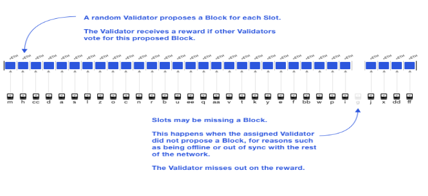

# Monitoring Attestations: Complete Guide for Lodestar Validators

## Introduction to Attestations

Validators participate in Ethereum's Proof of Stake by creating, signing, and broadcasting attestations each epoch. This helps secure the blockchain. You need 32 ETH staked to be a validator - this gives you skin in the game.

Validators do two main jobs on the beacon chain:

1. Proposing blocks
2. Creating attestations

The beacon chain extends the main chain. It stores and manages validator information.

Attestations are votes on whether blocks are valid. These votes get combined in the Beacon Chain so the network can agree on the correct state.

### Why Attestations Matter for Your Rewards

Most of your validator rewards come from attestations. Miss one or submit it late, you lose money. The network also loses some security.

You should create, sign, and broadcast an attestation when either:

- You get a valid block from the expected proposer, or
- 4 seconds pass since the slot started - whichever comes first

## Understanding the Attestation Workflow


Every successful attestation goes through five stages:

### Stage 1: Vote Creation and Signing

Takes about 0-1 seconds. Your validator checks the current chain state and creates attestation data with:

- Head block: The block you think is at the head right now
- Source checkpoint: Most recent justified block
- Target checkpoint: First block of the current epoch

You sign this with your validator's private key. The committee index doesn't go in the signed root, so identical votes from different committees look the same.

### Stage 2: P2P Network Propagation

Takes about 1-2 seconds. Your signed attestation broadcasts through Ethereum's gossip subnet system. If someone tries messing with the committee index, gossip rules reject it.

### Stage 3: Committee Aggregation

Takes about 2-3 seconds. Aggregators collect and bundle identical votes together. After the EIP-7549 upgrade, identical votes from different committees can be aggregated together.

Why this matters: Instead of checking 1,366 individual signatures, the system only verifies 22 aggregate signatures. Way more efficient.

### Stage 4: Broadcast to Block Proposers

Takes about 3-4 seconds. Aggregated attestations go to block proposers as compact bitfields. This format means blocks can fit more attestations per slot, boosting chain security and finality.

### Stage 5: Block Inclusion

Happens in the next slot. Block proposers include your aggregated attestations in their beacon blocks. More votes per block means stronger consensus and better finality.

## Critical Timing Requirements



The 4-Second Rule: Each 12-second slot has strict timing:

- First 4 seconds: You attest during this window
- Next 4 seconds: Aggregation happens
- Last 4 seconds: Block proposer prepares for next slot

Miss that first 4-second window and your chances of getting aggregated drop. This hurts your rewards.

Timeline breakdown in seconds:

- 0 to 4: Attestation duty
- 4 to 8: Aggregation
- 8 to 12: Next slot prep

## Flags Explained

Ethereum tracks validator performance with timing-based flags. Each flag affects your reward.

**Timely Head** - Included within 1 slot or 12 seconds. Gets you 100% reward. Confirms latest block as head.

**Timely Target** - Included within 32 slots or about 6.4 minutes. Gets you roughly 75% reward. Confirms finality checkpoints.

**Timely Source** - Included within 6 slots or about 1.2 minutes. Gets you roughly 25% reward. Confirms justified checkpoints.

**Missed or Late** - Too late or not included. Zero rewards plus penalties. Weakens security.

### What the Flags Mean

Timely Head means perfect! Your attestation made it into the very next slot. You voted on the correct head block and submitted on time.

Timely Target is good, but not perfect. Your attestation got included within the same epoch, confirming important finality checkpoints for Casper FFG.

Timely Source is minimal performance. Your attestation was delayed but made it within 6 slots, confirming some older justified checkpoints.

Missed means avoid this. Your attestation arrived too late or wasn't included. Zero rewards plus penalties.

## Lodestar Attestation Status Reference

Lodestar's attestation_summary metric gives diagnostic labels showing what happened with each attestation.

### Maximum Success

**timely_head** - Perfect, all timing requirements met. No action needed, keep going!

### Partial Success when Target Met

**timely_target_next_slot_missed** - Would've been perfect, but network skipped next slot. Not your fault.

**timely_target_wrong_head_vote** - Included on time but wrong head block. You set head block too late.

**timely_target_no_aggregate_inclusion** - Never seen in aggregate, caused delay. Network or aggregator problems.

**timely_target_late_unknown** - Inclusion distance greater than 1, reason unclear. Check logs.

### Partial Success with Combined Issues

**timely_target_wrong_head_vote_late_unknown** - Wrong head plus unknown delay.

**timely_target_wrong_head_vote_next_slot_missed** - Wrong head plus next slot missed.

**timely_target_wrong_head_vote_no_aggregate_inclusion** - Wrong head plus no aggregation.

### Critical Failures

**no_submission** - Validator never submitted attestation. CRITICAL - Check validator client.

**no_aggregate_inclusion** - Submitted but never seen in aggregates. HIGH priority - Network or aggregation issues.

**aggregate_inclusion_but_missed** - Seen in aggregates but not in blocks. MEDIUM priority - Block proposer issues.

### Advanced Diagnostic Labels

**unexpected_timely_target_without_summary** - Attestation on-chain despite not submitted to beacon node. Check for multiple beacon nodes.

**wrong_target_timely_source** - Correct source but wrong target, happens on first slot of epoch. Check head block import timing.

**unexpected\*** - Bad beacon node states preventing diagnosis. This is a catch-all for any label starting with `unexpected_` where a more specific reason could not be determined. Check beacon node health and logs.

## Debugging Sub-Optimal Attestation Performance

Not earning what you expected? Let's find out why and fix it.

## Monitor Your Validator Performance

Use monitoring tools instead of digging through logs manually.

### Check Attestation Success in Logs

Watch for successful submissions:

```bash
tail -f /var/log/lodestar/validator.log | grep "Published attestations"
```

If you're an aggregator:

```bash
tail -f /var/log/lodestar/validator.log | grep "Published aggregateAndProofs"
```

Healthy output looks like:

```
INFO [timestamp] Published attestations: slot=123456
INFO [timestamp] Published aggregateAndProofs: slot=123457
```

Seeing these regularly means your validator is submitting attestations.

## Use the HTTP API for Network Health

Lodestar has an HTTP API for checking node health. More reliable than searching logs.

### Check Peer Connections

View peer count:

```bash
curl -s http://localhost:9596/eth/v1/node/peer_count | jq
```

You'll see something like:

```json
{
  "data": {
    "disconnected": 0,
    "connecting": 0,
    "connected": 72,
    "disconnecting": 0
  }
}
```

What these mean:

- 50 to 100 peers: Good
- 20 to 49 peers: Okay, could be better
- Under 20 peers: Problem, attestations might not propagate

### Verify Sync Status

Check if synced:

```bash
curl -s http://localhost:9596/eth/v1/node/syncing | jq
```

When synced you'll see:

```json
{
  "data": {
    "is_syncing": false
  }
}
```

If is_syncing shows true, your node is catching up. Wait for sync before worrying about attestations.

### View Connected Peers

Get peer count:

```bash
curl -s http://localhost:9596/eth/v1/node/peers | jq '.data | length'
```

This shows total connected peers.

## Check System Health

Many performance issues come from resource constraints.

### Time Synchronization

Check system clock:

```bash
timedatectl status
```

You want System clock synchronized: yes - if no, attestations will fail.

Fix it:

```bash
sudo timedatectl set-ntp true
```

### Monitor System Resources

Check CPU and memory:

```bash
top -p $(pgrep -d',' -f lodestar)
```

View memory:

```bash
ps aux | grep '[l]odestar'
```

Check disk:

```bash
iostat -x 1 5
```

Watch for:

- CPU above 80%
- Memory climbing
- High disk wait times
- Swap usage, check with free -h

## Enable Prometheus Metrics

Prometheus gives time-series data for spotting trends.

### Enable Metrics

Start with metrics enabled:

```bash
lodestar beacon --metrics=true --metrics.port=8008
```

Check it works:

```bash
curl http://localhost:8008/metrics | head -20
```

### Key Metrics to Watch

**nodejs_heap_space_size_used_bytes** - Shows memory usage. Healthy is 100 to 500 MB. Problem when above 1.5 GB.

**nodejs_eventloop_lag_seconds** - Shows CPU responsiveness. Healthy is under 0.05 seconds. Problem when above 0.1 seconds.

**beaconchain_peers** - Shows connected peers. Healthy is 50 to 100. Problem when under 20.

**beaconchain_current_slot** - Shows chain position. Should match network. Problem when lagging.

### Understanding Metrics

Memory metric: Above 1.5 GB, garbage collection kicks in and pauses your node. If this happens during attestation, you miss it.

Event Loop Lag: Shows if CPU keeps up. High lag means tasks queue up, including attestation duties.

Peer Count: Low peers mean attestations might not reach aggregators. Sudden drops often match network issues.

## Set Up Grafana

Quick setup steps:

1. Get Prometheus from prometheus.io
2. Configure to scrape localhost:8008
3. Get Grafana from grafana.com
4. Add Prometheus as data source
5. Import Lodestar's dashboard

### Configure Prometheus

Create prometheus.yml:

```yaml
global:
  scrape_interval: 15s

scrape_configs:
  - job_name: "lodestar_beacon"
    static_configs:
      - targets: ["localhost:8008"]
```

Start it:

```bash
./prometheus --config.file=prometheus.yml
```

### Configure Grafana

Steps:

1. Open at http://localhost:3000
2. Go to Configuration then Data Sources
3. Add Prometheus with URL http://localhost:9090
4. Import or create dashboards

Look for: Correlate events. Peer count drops at 3:17 AM, attestations fail at 3:17:30 - you found it.

## Use beaconcha.in

Your node shows what it thinks. beaconcha.in shows what happened on-chain.

### Enable Monitoring

```bash
lodestar beacon \
  --monitoring.endpoint="https://beaconcha.in/api/v1/client/metrics?apikey=YOUR_KEY&machine=my-validator" \
  --monitoring.interval=60000
```

Get API key from beaconcha.in settings.

Why do this:

- Mobile alerts for offline validators
- Historical data
- Compare with network averages
- Track earnings

### Check Dashboard

Go to beaconcha.in, search your validator index. You'll see:

- Attestation effectiveness percentage
- Inclusion distance trends
- Missed attestations
- Income

Earning less than network average? Dig deeper. Everyone down? Network-wide issues.

## Effectiveness vs Inclusion Distance

Effectiveness accounts for network conditions, not just speed.

Attestation at slot S, included at slot I.

earliest_possible_inclusion equals E, which is the first slot after S with a block.

Formula: effectiveness = (E - S) / (I - S)

Key point: If next slot had no block because proposer was offline, you're not penalized. Can still hit 100% even with distance greater than 1.

Examples:

- Slot 5, included slot 6: 100% perfect
- Slot 5, no block slot 6, included slot 7: 100% not your fault
- Slot 5, block at slot 6, included slot 7: 50% you were slow

Check beaconcha.in for intervening slots.

## Common Issues

### Low Peer Count

Seeing: Under 20 peers

Fix:

- Check firewall, open LibP2P ports
- Port forwarding if behind NAT
- Add bootstrap nodes with --network.bootMultiaddrs
- Increase max peers with --network.maxPeers=100

### High Resource Usage

Seeing: CPU above 80%, memory climbing, high iowait

Quick fix:

- Restart Lodestar
- Stop other services
- Check for known bugs

Long-term:

- Upgrade hardware, more RAM and SSD
- Use NVMe instead of SATA
- Give more CPU cores

### Clock Issues

Seeing: is_syncing true won't clear, slot number off

Fix:

- Enable NTP with sudo timedatectl set-ntp true
- Check with timedatectl status
- Restart Lodestar

### Behind on Sync

Seeing: beaconchain_current_slot way behind network

Fix:

- Wait for sync
- Check execution layer synced
- Verify bandwidth for blocks
- Check disk I/O

## Debug Logging

For deep investigation, run with debug logs:

```bash
lodestar beacon --logLevel=debug 2>&1 | tee /var/log/lodestar/debug.log
```

Or with systemd:

```bash
sudo journalctl -u lodestar.service -f
```

Note: Debug logs are verbose. Only use when troubleshooting. Set up log rotation so disk doesn't fill.

## Regular Maintenance

Daily tasks:

- Check beaconcha.in for earnings
- Verify peer count via API
- Scan logs for errors

Weekly tasks:

- Review Grafana trends
- Update to latest stable
- Check resource usage

Monthly tasks:

- Analyze long-term patterns
- Compare with network average
- Tweak configuration

## Ask for Help

Tried everything? Reach out.

Lodestar Discord - The validator-support channel has experienced folks.

GitHub Issues - Search or open new issue.

Include:

- Lodestar version from lodestar --version
- Hardware specs
- Network setup like home, VPS, or cloud
- API health check output
- Log snippets with sensitive data removed
- When it started

## Goal: Consistent Performance

Perfect attestations every time is unrealistic. Network has reorgs, proposers miss slots, connectivity varies. Aim for above 98% effectiveness.

Hitting 99% or more means you're doing well. Everyone misses some. Patterns matter - consistent issues at specific times or with specific errors.

Watch metrics, use HTTP API for health checks, fix problems methodically. This maximizes earnings while helping secure Ethereum.
