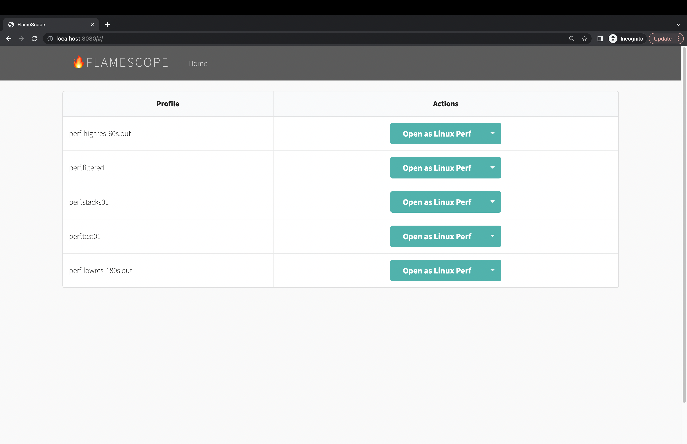
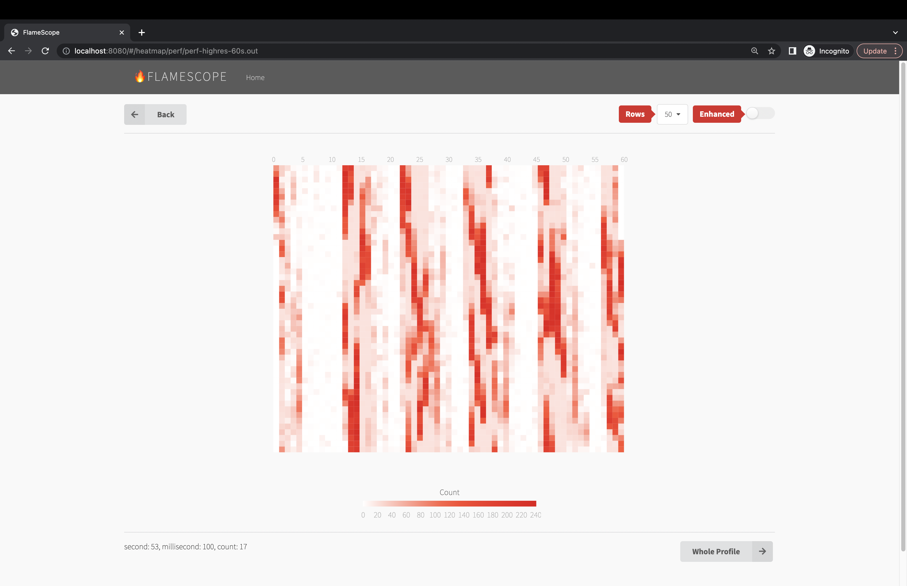
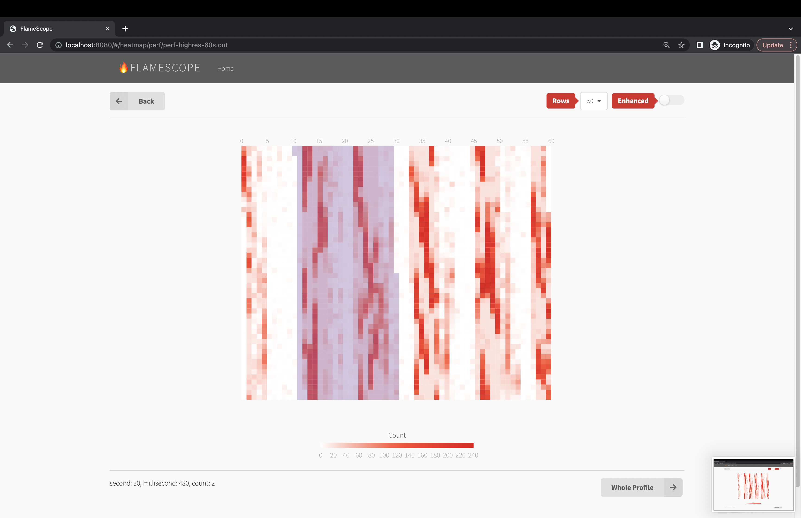
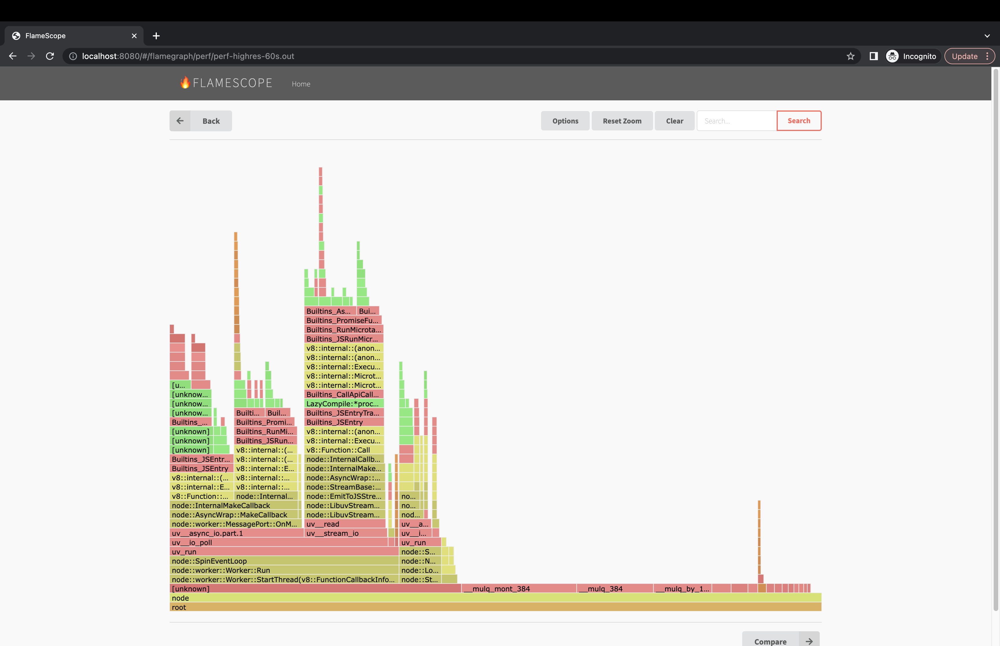
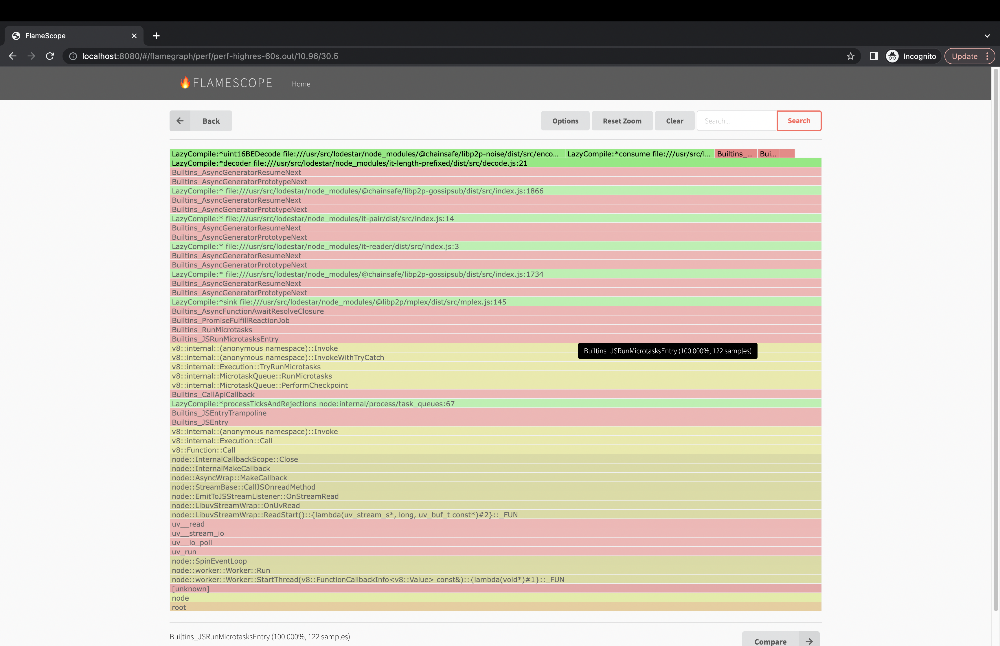
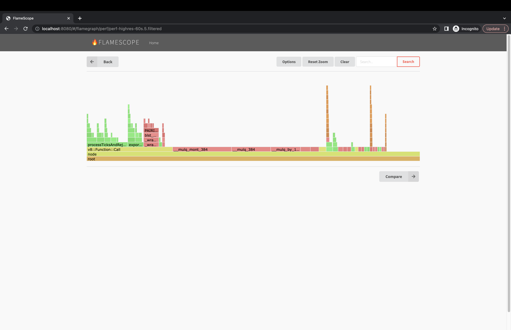

# Generating Flamegraphs for a Running Node Service on Linux

This guide assumes a running instance of Lodestar and will walk through how to generate a flamegraph for the process while running on Linux. While it is possible to run Lodestar in a number of ways, for performance profiling it is recommended to not use Dockerized implementations. It is best to run Lodestar as a service on a Linux machine. Follow the Lodestar docs to get the service installed and running. Then come back here when you are ready to generate the flamegraph.

## Modifying Linux and Lodestar

Use the following two commands to install `perf` for generating the stack traces. You may get a warning about needing to restart the VM due to kernel updates. This is nothing to be concerned with and if so, cancel out of the restart dialog.

```bash
sudo apt-get install linux-tools-common linux-tools-generic
sudo apt-get install linux-tools-`uname -r`  # empirically this throws if run on the same line above
```

Next we need to update the Lodestar service by modifying the start script. We need to add a necessary flag `--perf-basic-prof` to allow the stack traces to be useful. Node is a virtual machine and `perf` is designed to capture host stack traces. In order to allow the JavaScript functions to be captured meaningfully, `v8` can provide some help. Generally Lodestar is started with a script like the following:

### Example start_lodestar.sh

```sh
node \
  --perf-basic-prof \
  --max-old-space-size=4096 \
  /usr/src/lodestar/packages/cli/bin/lodestar \
  beacon \
  --rcConfig /home/devops/beacon/rcconfig.yml
```

After updating the start script, restart the node process running the beacon service. Note in the command below, that the `beacon` service may have a different name or restart command, depending on your setup.

```sh
admin@12.34.56.78: sudo systemctl restart beacon
```

The flag that was added notifies `V8` to output a map of functions and their addresses. This is necessary for `perf` to generate the stack traces for the virtual machine in addition to the traditional host stack traces. There is a very small, performance overhead to output the maps. After a short while, once the process runs for a bit the functions will no longer be moving in memory and the overhead will be significantly reduced. The VM will still be moving objects around but this flag is generally safe to run in production. After a few minutes of running, listing the directory with the start script (`process.cwd()`) will look similar:

```sh
-rw-r--r--  1 admin admin   9701529 May 22 00:36 beacon-2023-05-22.log
-rwxrwxr-x  1 admin root        421 May 22 00:31 beacon_run.sh
drwxr-xr-x  2 admin admin    917504 May 22 00:35 chain-db
-rw-r--r--  1 admin admin   2861242 May 22 00:36 isolate-0x6761520-2085004-v8.log
-rw-r--r--  1 admin admin    203172 May 22 00:36 isolate-0x7fa2f0001060-2085004-v8.log
-rw-r--r--  1 admin admin     68044 May 22 00:36 isolate-0x7fcd80001060-2085004-v8.log
-rw-r--r--  1 admin admin    420809 May 22 00:36 isolate-0x7fcd84001060-2085004-v8.log
-rw-r--r--  1 admin admin    123919 May 22 00:36 isolate-0x7fcd88001060-2085004-v8.log
-rw-r--r--  1 admin admin     94391 May 22 00:35 isolate-0x7fcd8c001060-2085004-v8.log
-rw-r--r--  1 admin admin    183831 May 22 00:36 isolate-0x7fcd90000e60-2085004-v8.log
-rw-r--r--  1 admin admin    152786 May 22 00:36 isolate-0x7fcd94000e60-2085004-v8.log
-rw-r--r--  1 admin admin    262333 May 22 00:36 isolate-0x7fcd98000e60-2085004-v8.log
-rw-r--r--  1 admin admin    218473 May 22 00:36 isolate-0x7fcd9c000e60-2085004-v8.log
-rw-r--r--  1 admin admin    366788 May 22 00:36 isolate-0x7fcda0000e60-2085004-v8.log
-rw-r--r--  1 admin admin    304917 May 22 00:36 isolate-0x7fcda4000e60-2085004-v8.log
-rw-r--r--  1 admin admin    586238 May 22 00:36 isolate-0x7fcda8000e60-2085004-v8.log
-rw-r--r--  1 admin admin    450675 May 22 00:36 isolate-0x7fcdac000e60-2085004-v8.log
-rw-r--r--  1 admin admin    768470 May 22 00:36 isolate-0x7fcdb8000d60-2085004-v8.log
-rw-r--r--  1 admin root        559 May 21 14:17 rcconfig.yml
```

The `isolate-*-v8.log` files are the maps that `v8` outputs for the `perf` command to reference. You are now ready to collect the stack traces.

### Capturing Stack Traces

The first command below will run `perf` for 60 seconds, and then save the output to a file named `perf.out`. The second one will merge the exported, unknown, tokens with the isolate maps and output full stack traces for the render. Running both `perf` commands in the folder with the `isolate` maps will allow the data to be seamlessly spliced. Once the output is saved, update the permissions so the file can be copied to your local machine via `scp`.

You can modify the frequency of capture by changing `-F 99` to a different number. Try to stay away from whole numbers as they are more likely to cause interference with periodically scheduled tasks. As an example use `99Hz` or `997Hz` instead of `100Hz` or `1000Hz`. In testing neither seemed to have an appreciable affect on CPU usage when run for a short period of time.

To change the period of capture adjust the sleep duration (which is in seconds).

The `pgrep` command is used to find the process id to capture against. Feel free to pass a number to the `-p` flag if you know the process id, or adjust the file path if the executable is in a different location.

```sh
admin@12.34.56.78: sudo perf record -F 99 -p $(pgrep -f '/usr/src/lodestar/packages/cli/bin/lodestar beacon') -g -- sleep 60
admin@12.34.56.78: sudo perf script -f > perf.out
admin@12.34.56.78: sudo chmod 777 ~/beacon/perf.out
```

And then copy the `perf.out` file to your local machine to render the flamegraph. Running at `99Hz` for 180 seconds results in a file size of about 3.5MB and `997Hz` for 60 seconds is roughly 4.4MB.

```sh
scp admin@12.34.56.78:/home/devops/beacon/out.perf /some_temp_dir/perf.out
```

## Rendering a Flamegraph

By far the best tool to render flamegraphs is [`flamescope`](https://github.com/Netflix/flamescope) from Netflix. It allows for easy analysis and zooming into specific time periods. It also give a holistic view of how the process is performing over time.

## Installation

Python3 is required. Clone the repository and install the dependencies:

_The original is no longer maintained and had a configuration bug. This is a fork that fixes the issue._

```sh
git clone https://github.com/matthewkeil/flamescope
cd flamescope
pip3 install -r requirements.txt
yarn
```

## Usage

```sh
mv /some_temp_dir/perf.out /path/to/flamescope/examples
yarn dev
```

Then navigate in a browser to `http://localhost:8080` and begin analyzing the data.







## Filtering Results

There can be a lot of "noise" in the stack traces with `libc`, `v8` and `libuv` calls. It is possible to filter the results to make it more useful, but note this will skew the results. Looking at the graph both filtered and unfiltered can be beneficial. The following `sed` command will remove the noise from the stack traces.

```sh
sed -r -e "/( __libc_start| uv_| LazyCompile | v8::internal::| node::| Builtins_| Builtin:| Stub:| LoadIC:| \\[unknown\\]| LoadPolymorphicIC:)/d" -e 's/ LazyCompile:[*~]?/ /'
```

### Unfiltered


### Filtered



## References

### List of Web References

- <https://www.brendangregg.com/flamegraphs.html>
- <https://nodejs.org/en/docs/guides/diagnostics-flamegraph>
- <https://netflixtechblog.com/netflix-flamescope-a57ca19d47bb>
- <https://jaanhio.me/blog/nodejs-flamegraph-analysis/> (this was a great one about filtering methodology)
- <https://medium.com/voodoo-engineering/node-js-and-cpu-profiling-on-production-in-real-time-without-downtime-d6e62af173e2>

### Visualization Tools

- [`flamescope`](https://github.com/Netflix/flamescope)

### Collecting on Linux

- <https://www.brendangregg.com/perf.html>
- <https://www.brendangregg.com/linuxperf.html>
- <https://www.brendangregg.com/blog/2014-09-17/node-flame-graphs-on-linux.html>
- <https://perf.wiki.kernel.org/index.php/Main_Page>

### Collecting on MacOS

- <https://gist.github.com/zeusdeux/aac6f8500917319213c5>
- <https://gist.github.com/loderunner/36724cc9ee8db66db305>
- <https://keith.github.io/xcode-man-pages/xctrace.1.html>
