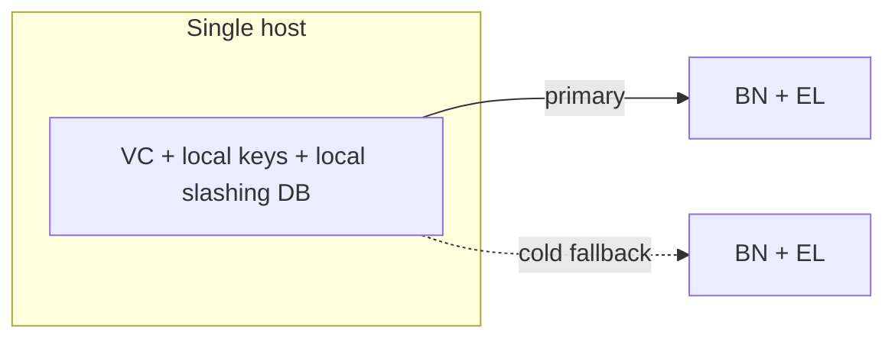
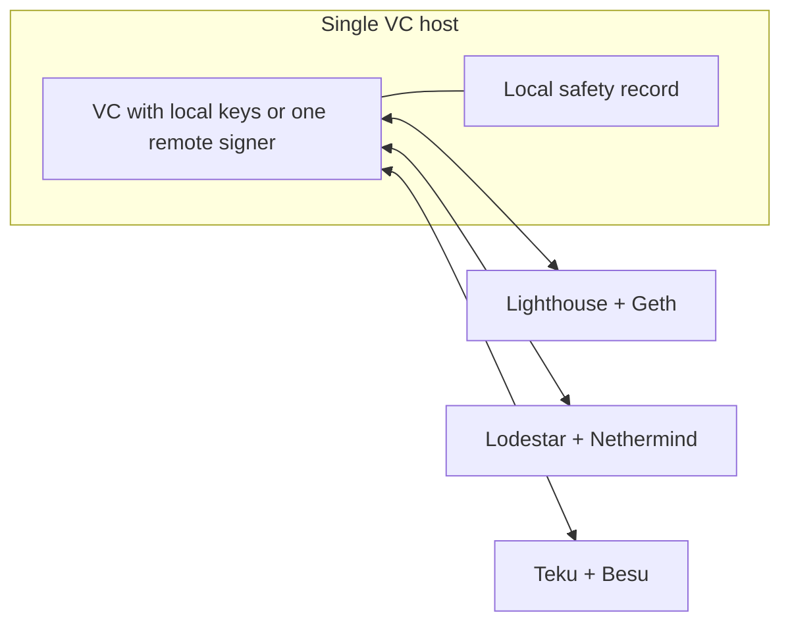
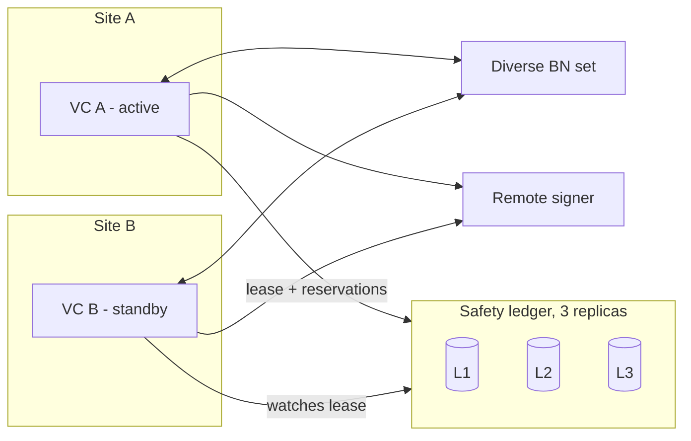
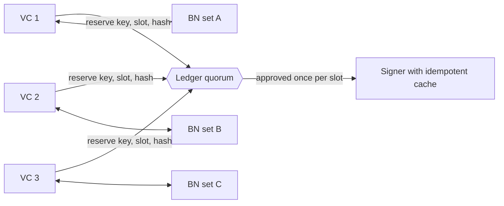
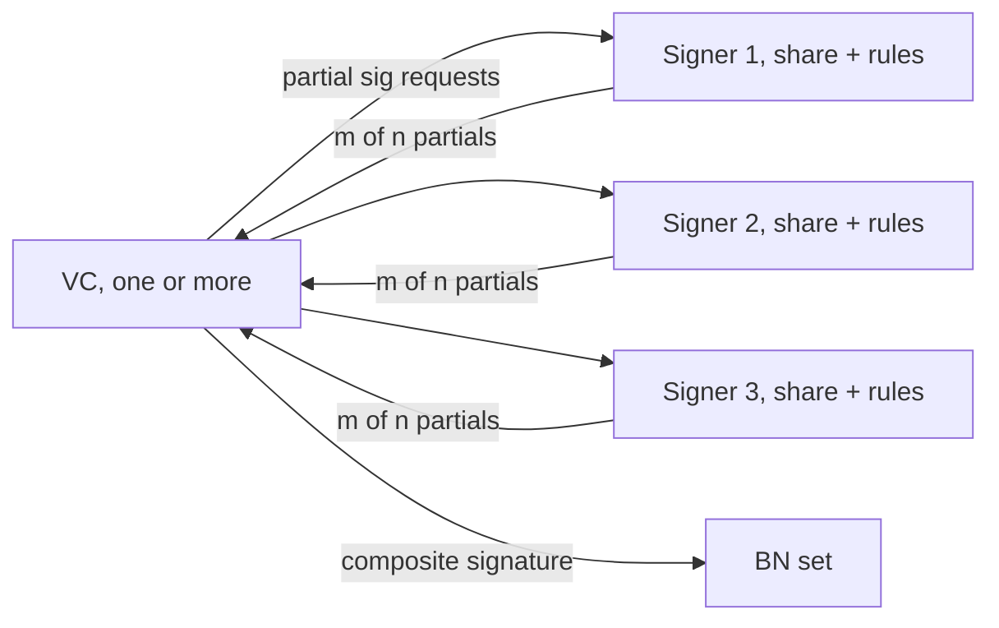
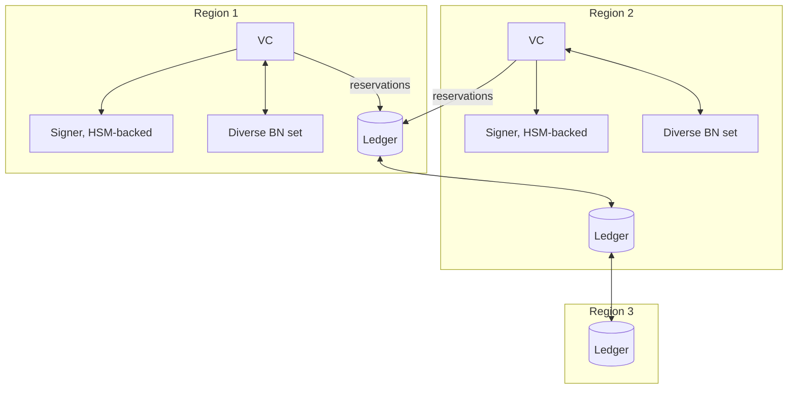
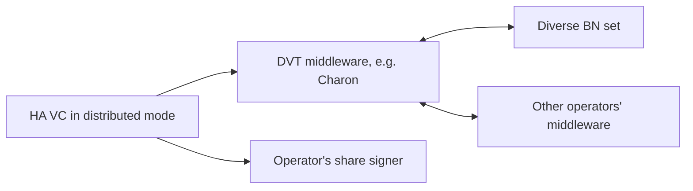

# High Availability from First Principles: Reference Architectures for Ethereum Validators

This document steps back from the competitor analyses and asks what high availability (HA) means for an Ethereum validator operator, which failures matter, where redundancy is cheap and where it is dangerous, and what a small number of idealised setups look like. It is intended as the basis for the user experience of the Lodestar HA product: the concepts an operator must understand, the journeys they must be able to complete, and the guardrails the product must enforce. It draws on the [Lodestar baseline](./lodestar-ha-baseline.md), the [Vouch](./vouch-feature-analysis.md), [Dirk](./dirk-feature-analysis.md) and [Vero](./vero-feature-analysis.md) analyses, and the [post-quantum options](./post-quantum-signing-options.md).

## 1. What an operator is optimising

In priority order:

1. **Never sign a slashable or key-compromising message.** A slashing costs at least 1 ETH, forced exit and a correlation penalty. Under post-quantum (PQ) keys the same mistake leaks the key. This goal dominates every other; when the system cannot decide safely it must not sign.
2. **Never miss a proposal.** One proposal is worth hundreds of attestations in rewards and MEV, and proposals are rare, so a proposal missed during a failover is the most visible HA failure.
3. **Miss as few attestations and sync committee messages as possible**, and submit them early enough to earn full timeliness rewards.
4. **Survive any single failure without human action**, and survive planned maintenance of any component with zero missed duties.
5. **Recover from any failure without slashing risk**, including host loss, with documented, tested procedures.
6. **Know what is happening.** Which component is degraded, which instance is active, why a duty was skipped, and whether the safety invariant was ever tested.
7. **Keep it simple and hard to misconfigure.** Every extra moving part is a new failure domain and a new way to accidentally run the same key twice.
8. **Protect key material** proportionate to the stake, without making custody the reason duties are missed.
9. **Cost.** Hardware, bandwidth and operator time have diminishing returns past the second or third redundant component.

Goals 1 and 4 are in tension. The purpose of the architectures below is to make that tension explicit and to bound how much of goal 4 must be given up to guarantee goal 1.

## 2. The system decomposed

| Layer                 | Role                                                                | State it holds                                  | Can it be replicated freely?                                               |
| --------------------- | ------------------------------------------------------------------- | ----------------------------------------------- | -------------------------------------------------------------------------- |
| Execution client (EL) | Builds and validates payloads                                       | Chain state (rebuildable)                       | Yes                                                                        |
| Beacon node (BN)      | Chain state, duties, attestation data, block production, gossip     | Chain state (rebuildable)                       | Yes                                                                        |
| Validator client (VC) | Schedules duties, chooses data, orchestrates signing and publishing | Duty cache, per-key configuration (rebuildable) | Yes, if it holds no safety state                                           |
| Signer                | Holds keys, produces signatures                                     | Key material                                    | Yes for BLS via replication or sharding; PQ only by whole-seed replication |
| Safety record         | What has been signed per key                                        | Slashing protection, PQ leaf high-water marks   | Only with strong consistency                                               |
| Coordination          | Which instance may act                                              | Leases, quorum decisions                        | Only with strong consistency                                               |
| MEV path              | Builder bids, registrations, unblinding                             | Registrations cache (rebuildable)               | Yes                                                                        |
| Infrastructure        | Hosts, network, clocks, datacentres, providers                      | None                                            | Yes                                                                        |

The decomposition yields the central observation of this document: **everything except the safety record and the coordination decision is rebuildable and can be replicated without risk.** Reads can fan out, publishes can fan out, duty computation can run anywhere. The only thing that must be done exactly once, and therefore the only thing that needs strong consistency, is the decision to sign a particular message for a particular key at a particular slot.

Today's Lodestar VC couples the safety record to the VC process (a local LevelDB), which is why it cannot be replicated. Vouch moves the record into Dirk. Vero removes it from the VC entirely and relies on the signer, with a closed-source quorum service for multi-instance. The product design question is where to put it.

## 3. Failure model

| Failure                                            | Likelihood                          | Impact if unhandled                                                      | Detection signal                   |
| -------------------------------------------------- | ----------------------------------- | ------------------------------------------------------------------------ | ---------------------------------- |
| EL down or syncing                                 | Common                              | BN goes optimistic, no proposals, attestations may be wrong              | BN `el_offline`, `is_optimistic`   |
| BN down                                            | Common                              | All duties from that node fail                                           | Connection errors, `/node/syncing` |
| BN slow (late head, slow attestation data)         | Common                              | Late or missed attestations                                              | Head event timing, request latency |
| BN wrong (client bug, bad head, wrong checkpoints) | Rare, correlated across same client | Votes on a wrong fork, missed rewards, in the worst case inactivity leak | Disagreement with other nodes      |
| VC process crash                                   | Occasional                          | All duties stop until restart                                            | Process exit, health endpoint      |
| VC host loss                                       | Rare                                | Duties stop; safety record lost if local                                 | Host unreachable                   |
| VC planned upgrade                                 | Frequent                            | A few missed duties per restart                                          | Operator initiated                 |
| Signer down or slow                                | Occasional                          | Signatures fail; duties missed                                           | Sign errors, health check          |
| Signer host loss                                   | Rare                                | Keys unavailable; if the safety record lives there, it is lost too       | Host unreachable                   |
| Safety record unavailable (minority of replicas)   | Occasional                          | None if quorum holds                                                     | Replica health                     |
| Safety record unavailable (majority or partition)  | Rare                                | Must stop signing                                                        | Quorum loss                        |
| Network partition between components               | Occasional                          | Depends on which side holds quorum                                       | Timeouts                           |
| Datacentre or region loss                          | Rare                                | Everything in it                                                         | Multiple hosts unreachable         |
| Clock skew on one host                             | Occasional                          | Early or late duties; lease misjudgement                                 | NTP offset, slot mismatch with BN  |
| Operator starts a duplicate instance               | Occasional, human error             | Double signing unless prevented                                          | Doppelganger, ledger refusal       |
| Stale restore of safety record                     | Rare, human error                   | Double signing, PQ leaf reuse                                            | High-water mark regression         |
| Key theft                                          | Rare                                | Total loss                                                               | Out of band                        |
| MEV relay down or slow                             | Common                              | Local block instead of MEV block                                         | Bid timeouts                       |

Correlated failures deserve emphasis. Two beacon nodes running the same client implementation fail together on a consensus bug. Two hosts in one rack fail together on a power event. Two instances with the same misconfiguration fail together on a fork transition. Redundancy only counts when the replicas are independent along the axis that fails.

## 4. First principles

### 4.1 Reads fan out, signatures are gated

Fetching duties, attestation data, aggregates, block proposals and head events from several nodes concurrently is free of safety risk and strictly improves both liveness and correctness. Publishing signed objects to several nodes is also safe: duplicates are deduplicated by gossip. The only operation that must be serialised is producing a signature. A design that fans out everything and gates only signing gets almost all the benefit of redundancy at almost none of the risk.

### 4.2 The exactly-once invariant and where to enforce it

The invariant is: for each key and each slot (or target epoch for attestations), at most one distinct message is ever signed, across all instances and all restarts. There are four places to enforce it:

| Enforcement point               | Example                         | Enables active-active VC?           | Trust base           | Notes                                                                                                                                                     |
| ------------------------------- | ------------------------------- | ----------------------------------- | -------------------- | --------------------------------------------------------------------------------------------------------------------------------------------------------- |
| In the VC, local database       | Lodestar today                  | No                                  | Single process       | Simple, but ties the VC to one host                                                                                                                       |
| In the signer, per instance     | Dirk rules, Web3Signer database | Yes, if all VCs use the same signer | The signer           | Safe across VCs; the signer is a single point of failure unless replicated, and replicated signers need their own agreement                               |
| In a separate replicated ledger | Vero's Devo                     | Yes                                 | Ledger quorum        | Signer and VC both stateless for safety; one quorum round per signature                                                                                   |
| In the cryptography             | BLS m-of-n with signer rules    | Partly                              | Threshold of signers | Independent signing below the threshold is impossible; two full quorums can still double sign unless the signers also keep rules; unavailable for PQ keys |

The ledger option is the only one that is independent of signer type, works for local keys and remote signers alike, carries over unchanged to PQ keys (where EIP-8310 names the slashing database as the leaf-state authority), and allows both the VC and the signer to be replicated freely. It is also the option no open-source competitor offers.

### 4.3 Consistency over availability

Under a partition the system must choose between signing without confirmation and not signing. For validator keys the choice is forced: a missed attestation costs a tiny fraction of the stake, a slashing costs at least 1 ETH, and a PQ leaf reuse costs the key. The product must therefore be fail-closed at the signing gate, and the design goal becomes minimising how often and for how long the gate cannot decide, not eliminating it. Practically this means: the ledger quorum should be as close to the signers as latency allows, a minority of ledger replicas may fail without effect, and a lost majority stops signing until repaired.

### 4.4 Timing budgets

On mainnet an attestation is due 4 seconds into a 12-second slot and an aggregate at 8 seconds; sync messages follow the same schedule. Slot times are expected to shrink. Everything on the signing path has to fit inside the attestation window with margin:

- Head event to attestation data agreement: under 1 second.
- Ledger reservation round trip: under 100 milliseconds, which permits cross-region quorum within one continent.
- Signature: sub-millisecond for BLS and for leanXMSS.
- Publish fan-out: fire and forget after the first success.

Failover detection for an active-passive pair should therefore be faster than a slot if it is to save the current slot's attestation, and no slower than two slots if it is to save a proposal that a dying leader was about to make. A lease of about one slot with heartbeats every quarter slot is a reasonable starting point.

### 4.5 Diversity is a form of redundancy

Three beacon nodes of the same implementation protect against host failure but not against a client bug, which is the failure most likely to affect all of them at once. Two or three implementations with majority agreement on attestation data protect against both, and this is the single feature that Vero exists to provide. The same logic applies to execution clients, to hosting providers and, for large operators, to regions.

### 4.6 Active-active versus active-passive

Active-passive is simpler to reason about, halves the load on beacon nodes and signers, and gives an unambiguous answer to "who is active". Its cost is failover latency and the risk that the standby is silently broken. Active-active has zero failover latency and continuously exercises every instance, at the cost of duplicated load and of divergent requests that the ledger must refuse. With a ledger that enforces the invariant and a signer that answers identical duplicates idempotently, active-active is safe; whether it is desirable depends on whether the operator's beacon nodes can carry the doubled load. Both modes should be offered on the same substrate, chosen by configuration.

### 4.7 Explicit coordination beats inferred coordination

Vouch's static-delay infers whether another instance acted by looking for its attestation in the beacon node's pool. It needs no infrastructure, but it depends on beacon nodes subscribing to all subnets, costs four seconds of attestation timing, and gives the operator no view of who is active. An explicit lease or quorum is more infrastructure but is observable, testable and fast. The product should default to explicit coordination and may offer inference as a degraded fallback.

### 4.8 Determinism and idempotency

If a signer produces byte-identical output for identical input, a second request from another instance is harmless and can be answered from a cache. BLS is deterministic; leanXMSS is deterministic in both reference implementations but not in the abstract scheme, so the product must pin the implementation. Idempotent signing turns the common active-active race (two instances asking for the same attestation) from a refusal into a success.

### 4.9 Planned transitions are the common case

Operators restart validator clients for upgrades far more often than hosts die. A planned handover, where the active instance finishes the current slot's duties, hands the lease to the standby, and then exits, should be a first-class command that costs zero duties. Crash failover is the rare case and may cost a slot.

### 4.10 Recovery is where slashings happen

Most real slashings come from operational error: restoring a backup with stale protection data, migrating keys without the interchange file, or starting a second instance during an incident. The product must make the safe path the only path: refuse to import a key with fresh state, refuse a protection record that regresses, refuse to start with a key that another instance holds a lease for, and default doppelganger detection on for keys not seen by the ledger.

### 4.11 Custody and availability pull in opposite directions

Sharding a BLS key across signers gives both availability and custody: no host holds a whole key. Post-quantum keys cannot be sharded, so availability requires whole-seed replication and custody has to come from encryption at rest, hardware modules or enclaves, and Shamir sharing for recovery only. Architectures should state which custody property they provide and how it changes under PQ.

## 5. Reference architectures

Each architecture names the operator profile it serves, its topology, its safety mechanism, what it covers, its failover characteristics, its complexity, the competitor setups it resembles, how it fares under PQ, and what the operator must configure and see.

### A0. Single validator client with fallback nodes (baseline, not HA)

Profile: any operator today. Topology: one VC, local keys, local protection, one or more beacon nodes used as primary and cold fallbacks. Safety: local database, single process. Coverage: primary node loss after a timeout. Not covered: VC host loss, signer loss, client bugs, maintenance without misses. Under PQ: the local database becomes the leaf-state authority, which is correct but still single-host. Included as the reference point.

### A1. Single validator client over a diverse beacon node set

Profile: solo and small operators, 1 to a few hundred validators, who want protection from client bugs and node failures without running a cluster. Topology: one VC; three beacon node and execution client pairs of different implementations, ideally on separate hosts; keys local or on one remote signer. Safety: local safety record, single VC process, doppelganger on start. Beacon layer is active-active: reads fan out, attestation data must be agreed by a majority, blocks produced on every node and the best published, publishes fan out, head events from every node.

Covers: any single node or execution client failure, a single-client consensus bug, slow nodes. Not covered: VC host loss (recovery is restore from backup or wait two finalized epochs), signer loss. Failover: none needed at the beacon layer. Complexity: low; the only new concept is the node set and its agreement threshold. Competitors: Vero's open-source configuration; Vouch with `best` or `majority` strategies and the multinode submitter. Under PQ: unchanged, the local record is the leaf authority.

Operator configures: node URLs, agreement threshold (default majority), optional proposal-only nodes. Operator sees: per-node health, head timing, agreement contribution, which node's block was used.

### A2. Active-passive validator pair over a shared ledger

Profile: professional operators who need zero-miss maintenance and protection against VC host loss, and who can run three small ledger replicas. Topology: two VC instances on different hosts or sites, both configured identically from one cluster definition; a replicated safety ledger of three nodes; a shared remote signer (or replicated local keys, see custody note); a diverse beacon node set shared or split between the instances. Safety: the ledger holds a lease naming the active instance and records every reservation (key, slot, message hash) before a signature is released; the signer accepts requests only with a valid fencing token; the ledger enforces EIP-3076 rules and, later, PQ leaf high-water marks.

Covers: VC host loss (standby acquires the lease after expiry), planned VC upgrades (explicit handover, zero misses), all A1 coverage, operator error of starting a third instance (it cannot get a lease). Not covered: signer loss unless the signer is itself replicated; loss of two ledger replicas stops signing. Failover: lease duration, about one slot, so at most one attestation round lost on a crash and none on a planned handover. Complexity: medium; new concepts are cluster, member, lease, ledger. Competitors: Vero's sponsor-only Automatic Failover plus Devo; Vouch static-delay approximates it without a ledger and with a four-second timing cost. Under PQ: unchanged in shape; the ledger is the leaf authority and the fencing token prevents a stale leader from consuming a leaf.

Operator configures: cluster identity and members, ledger endpoints, lease length, signer endpoint, node set. Operator runs: `handover`, `drain`, `status`. Operator sees: who is active, lease age, ledger quorum health, last reservation per key, refused requests.

### A3. Active-active validator cluster over a quorum ledger

Profile: operators who want zero failover time and continuous exercise of every instance, and whose beacon nodes can carry duplicated load. Topology: N VC instances, all active, each possibly with its own beacon node set; a quorum ledger; a signer that answers identical duplicate requests from a cache. Safety: the ledger admits exactly one message hash per key per slot; identical requests from other instances are served the same signature; divergent requests are refused and reported. Because all instances publish the same signature, gossip sees harmless duplicates.

Covers: everything in A2 with zero failover latency; instances with different beacon node sets add client diversity at the VC level too. Not covered: signer loss unless replicated; ledger majority loss. Failover: none. Complexity: medium to high; duplicated load on beacon nodes and signer; divergence refusals must be understood by operators as expected events, not faults. Competitors: Vero with Devo is exactly this; Vouch static-delay is a passive-first cousin. Under PQ: this is the case where deterministic signing and the idempotent cache are essential; without them active-active is unsafe for PQ keys.

Operator configures: as A2 without a lease, plus per-instance node sets. Operator sees: per-instance reservation wins, divergence refusals with the two competing messages, per-instance timing.

### A4. Distributed BLS signer cluster (threshold keys)

Profile: operators for whom key custody is paramount and who accept a key generation ceremony. Topology: n signer instances each holding a share generated by distributed key generation with threshold m greater than n/2; each signer keeps monotonic per-key rules; one or more VCs compose signatures. Safety: no signer can produce a signature alone; each signer's rules deny a second attestation per target epoch or a second proposal per slot; a conflicting composite needs m fresh approvals. Multiple VCs coordinate either by passive takeover or, better, by a ledger as in A2 or A3.

Covers: loss of up to n minus m signers, signer host compromise short of m hosts, VC loss when combined with A2 or A3. Not covered: resharing or replacing a lost participant (no supported path in Dirk today), and the protection state is per signer with no replication. Failover: none at the signer layer. Complexity: high; certificates, peers, ceremony, and a client library that must reach every participant. Competitors: Vouch plus Dirk is the reference implementation; Obol and SSV provide the same property across organisations. Under PQ: the sharding property disappears entirely. The signers can still be replicated as whole-seed holders with rules, but then A4 collapses into A2 or A3 with signer replicas, and custody must come from hardware or enclaves.

Operator configures: signer endpoints, certificates, threshold at key generation. Operator sees: shares online versus threshold, per-signer denials, composition latency.

### A5. Multi-region institutional cluster

Profile: institutional operators with tens of thousands of validators, multiple regions or providers, compliance requirements and hardware-backed custody. Topology: per region a full stack (VC, diverse beacon node set, signer with hardware-backed or enclave custody); a ledger with replicas across three regions so that any one region can be lost; key sets partitioned across regions in normal operation so that each region is active for its own keys and standby for the others; ledger shards per key set to keep quorum latency low. Safety: as A2 or A3, with the added rule that a key set's active region is a ledger-held lease and handover between regions is explicit. Custody: signers never export seeds; PQ seeds live in modules or enclaves with Shamir-shared recovery.

Covers: region or provider loss, everything in A2 and A3, custody requirements. Not covered: correlated software bugs across regions (mitigated only by staggered upgrades). Failover: one lease for a crash, zero for planned region handover. Complexity: high; requires ledger operations expertise. Competitors: none offer this openly; it is what large operators assemble from Vouch, Dirk and internal tooling. Under PQ: the ledger and lease model carries over; the custody layer becomes the critical differentiator because sharding is gone.

Operator configures: regions, per-region stacks, key set to region assignment, ledger placement. Operator sees: a fleet view of active region per key set, cross-region ledger latency, staggered upgrade status.

### A6. Distributed validator cluster participant

Profile: an operator running one node of an Obol or SSV style cluster where the threshold and duty agreement are provided across organisations by the middleware. Topology: the HA VC runs in distributed mode and talks to the middleware as if it were a beacon node; the middleware talks to the operator's own diverse beacon node set. Safety: the middleware's cluster consensus ensures one duty decision per slot; the operator's share signer must still never double sign its share, so the operator's own ledger or signer rules remain in force. Coverage: the cluster tolerates f operators offline, so this operator's own HA requirement is weaker; the product's value here is a robust node behind the middleware and the same guardrails against operator error.

Under PQ: the middleware's threshold property disappears with BLS. Distributed validator protocols will need the same whole-seed replication plus consensus model, at which point the middleware and the ledger converge.

## 6. Coverage matrix

Legend: Y covered, P partial, N not covered.

| Failure                               | A0              | A1  | A2               | A3                         | A4             | A5               | A6  |
| ------------------------------------- | --------------- | --- | ---------------- | -------------------------- | -------------- | ---------------- | --- |
| EL down                               | P               | Y   | Y                | Y                          | Y              | Y                | Y   |
| BN down                               | P               | Y   | Y                | Y                          | Y              | Y                | Y   |
| BN slow                               | N               | Y   | Y                | Y                          | Y              | Y                | Y   |
| BN client bug                         | N               | Y   | Y                | Y                          | P              | Y                | Y   |
| VC process crash                      | N               | N   | Y                | Y                          | P              | Y                | Y   |
| VC host loss                          | N               | N   | Y                | Y                          | P              | Y                | Y   |
| VC planned upgrade with zero misses   | N               | N   | Y                | Y                          | P              | Y                | Y   |
| Signer down                           | N               | N   | P                | P                          | Y              | Y                | Y   |
| Signer host compromise                | N               | N   | N                | N                          | Y              | P                | Y   |
| Ledger minority loss                  | n/a             | n/a | Y                | Y                          | n/a            | Y                | n/a |
| Ledger majority loss or partition     | n/a             | n/a | N, stops signing | N, stops signing           | n/a            | N, stops signing | n/a |
| Region or provider loss               | N               | N   | P                | P                          | P              | Y                | Y   |
| Duplicate instance started by mistake | P, doppelganger | P   | Y                | Y                          | Y              | Y                | Y   |
| Stale restore of safety record        | N               | N   | Y                | Y                          | P              | Y                | P   |
| PQ leaf reuse across replicas         | N               | N   | Y                | Y, with idempotent signing | N, no sharding | Y                | P   |

## 7. Synthesis

The architectures form a progression on one substrate:

- A1 is the entry point and needs only the multi-node beacon layer.
- A2 adds the ledger and lease and is the first setup that survives VC host loss and zero-miss upgrades.
- A3 is A2 without a lease, for operators who prefer zero failover time over halved load.
- A5 is A2 or A3 replicated across regions with ledger sharding and hardened custody.
- A4 is a signer backend choice that any of A2, A3 or A5 can use for BLS keys today.
- A6 is a mode of the same VC.

The substrate has three parts: a validator client whose beacon layer is active-active and whose duty logic holds no safety state; a replicated safety ledger that enforces exactly-once signing per key and slot for both BLS and PQ keys and holds leases; and a signer interface that requires fencing tokens and supports idempotent signing, with backends for local keys, the Ethereum Remote Signing API, Dirk, and future PQ seeds. This is the design that no competitor offers in the open, that carries over to post-quantum keys without redesign, and that lets a solo staker and an institution run the same software.

## 8. Implications for user experience

### 8.1 Concepts the operator must be able to hold in their head

- **Node set**: the beacon nodes the VC reads from and publishes to, with an agreement threshold and optional proposal-only members.
- **Cluster**: a named set of VC instances that share keys, defined once and distributed to every member.
- **Member and role**: each instance's identity and whether it is active, standby or one of several actives.
- **Ledger**: the replicated safety record; its quorum health is the single most important status.
- **Signer backend**: where keys live and how the VC authenticates to it.
- **Key set**: the validators the cluster is responsible for, with per-key settings.

Six concepts is already a lot. The product should hide the ledger for A1 (embedded, single replica, local), introduce it explicitly only when a second member is added, and never require the operator to reason about fencing tokens or reservation protocols.

### 8.2 Journeys that must be smooth

1. **Start with one node and grow.** Add a second beacon node of a different client; the agreement threshold updates with a clear explanation of what changes.
2. **Add a second VC instance.** The product refuses until a ledger with at least three replicas is configured or an explicit single-replica acknowledgement is given, then walks through the lease settings.
3. **Rolling upgrade.** `handover` moves the lease after the current slot's duties; `drain` stops an instance from taking the lease; both report zero missed duties.
4. **Host loss and rebuild.** Restore the cluster definition, join the cluster, and the new member learns the safety record from the ledger. There is no interchange file to move and no two-epoch wait, because the record never lived on the lost host.
5. **Key import and migration.** Interchange import is required for keys with history; import with fresh state for a key the ledger has not seen triggers mandatory doppelganger detection; a PQ key with fresh state is refused outright.
6. **Divergence incident.** Two instances asked to sign different attestation data for one slot; the ledger refused one. The status view shows both messages, which nodes produced them, and which instance won, so the operator can find the misbehaving beacon node.
7. **Ledger degradation.** A minority replica is down: warn. Quorum lost: stop signing, page the operator, and show exactly which replicas are unreachable.
8. **Post-quantum key registration.** Generate the seed offline, register the public key through the ledger, see leaf consumption from the first proof of possession onward.

### 8.3 Guardrails the product enforces

- Refuse to start a second instance for a key set without a ledger.
- Refuse to import a safety record that regresses any high-water mark.
- Refuse to sign when the ledger quorum is unavailable, with no override flag.
- Refuse a node set where a single client implementation holds a majority when agreement is enabled, unless acknowledged.
- Default doppelganger detection on for keys unknown to the ledger and off for keys the ledger has seen recently, so restarts are fast and first starts are safe.
- Refuse PQ signing if replicas report different signer implementations or versions.
- Require an explicit acknowledgement to run local keys on more than one member.

### 8.4 What the operator must be able to see

A single status surface, available as a health endpoint, a CLI command and a dashboard, answering: Is the ledger healthy? Who is active for which keys? Is every node healthy, in agreement and timely? Did every duty in the last epoch succeed, and if not, why? Were any requests refused for safety? How much PQ leaf budget has each key consumed? Per-node, per-instance and per-signer metrics with the labels needed to answer those questions.

### 8.5 Defaults

The right default for a new operator is A1: one VC, three diverse nodes, majority agreement, fan-out publishing, embedded ledger, doppelganger on. Every step toward A2 and beyond should be an explicit, guided decision that names the new failure domain it protects against and the new component the operator now has to run.

## 9. Open questions for the PRD

1. Should the ledger be a separate deployable, an embedded Raft group inside the VC instances, or both?
2. How small can the ledger quorum round trip be made, and does it fit alongside attestation data agreement at 4-second slots?
3. Should the signer be a Lodestar product (local keys plus ledger enforcement) or only an interface to Web3Signer and Dirk?
4. Is A3 active-active worth its duplicated load for most operators, or is A2 with a fast planned handover enough?
5. How much of the beacon layer (agreement thresholds, per-operation strategies) should be exposed, and how much fixed to sensible defaults?
