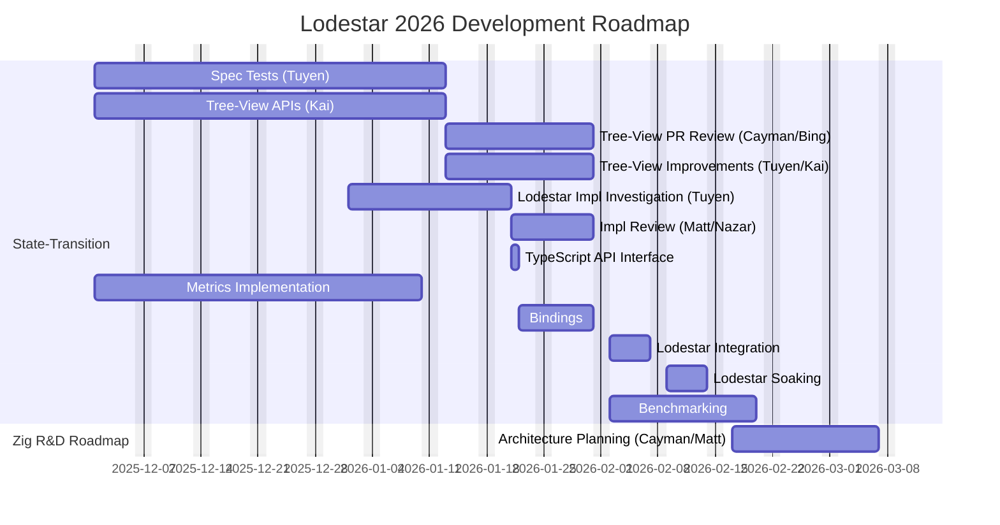

<!--
        Benchmarking R&D:               zr2, after zr1, 30d
        Napi Bindings (napi-z repo):    zr3, 2025-12, 30d

    section LodestarZ
        Fork-Choice:                    lz1, 2026-07, 45d
        Execution-Engine:               lz2, 2026-07, 45d
        Clock:                          lz3, 2026-07, 45d
        Database:                       lz3, 2026-07, 45d
        Seen-Cache:                     lz3, 2026-07, 45d
        Op-Pools:                       lz3, 2026-07, 45d
        Peer:                           lz3, 2026-07, 45d

        Peer Manager:                   lz3, 2026-07, 45d
-->
